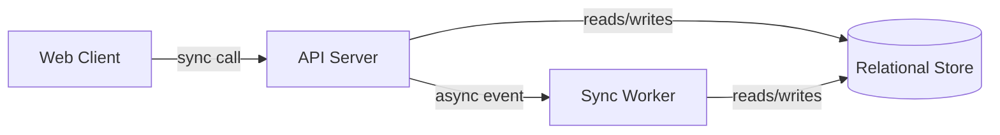
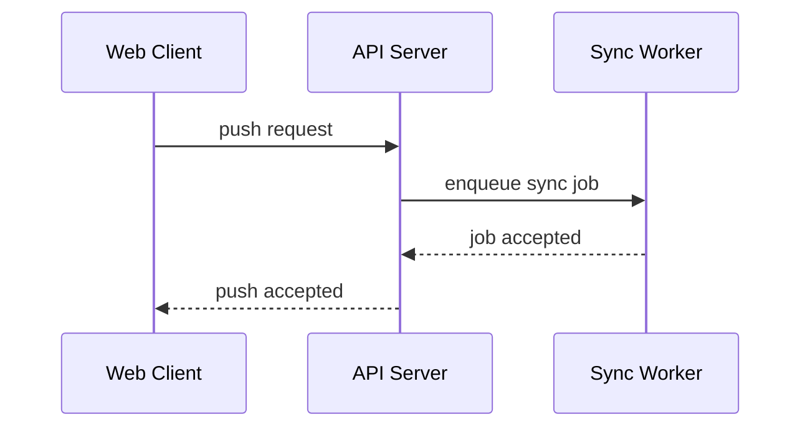

# Task: Generate ARCHITECTURE.md — Structural Blueprint of the System

## Objective

Produce an ARCHITECTURE.md that serves as the structural blueprint for the system: what components exist, what each is responsible for, how they connect, what technology each uses, which foundational decisions were made and why, and what shape the deployment takes. The document fixes the architectural *style*, inventories every component with its responsibility and deployable form, draws the topology, walks every cross-cutting scenario as a cross-component flow, inlines an `ADR-NN` for every decision with real alternatives, sketches deployment at a 1–2-page level, names system-level quality-attribute headlines, and calls out evolution seams and out-of-scope structural choices. An agent reading this document alone can place any downstream concern (a new endpoint, a new schema, a new surface, a new component) into the correct structural slot without guessing — and can explain *why* the shape is what it is.

ARCHITECTURE.md is produce-once and read-many: every IA skill, `/interfaces`, `/data`, `/behavior`, `/quality`, `/security`, `/operations`, `/WORK_UNITS.md`, and most `/spec` agents read it. Treat every component name, `ADR-NN` ID, and flow as a permanent commitment. The defining rule — and the commonest violation — is **structure, not surface**: this document owns *what components exist and why*, never the wire formats, schemas, UI, state machines, error taxonomy, or detailed ops that sibling artifacts own.

---

## Inputs

1. **PROPOSAL.md** (required) — § 2 Solution Thesis seeds the architectural style; § 3 Core Principles constrain every decision and often *are* the rationale on ADRs; § 4 Non-Goals bound the component inventory; § 7 Scope Boundaries anchors what must be structurally supported in v1.
2. **USE_CASES.md** (required) — § 1 Actors name who the system serves (and therefore which client-side components exist); § 2 Use Case Catalogue names every capability the components must collectively realise; § 3 Cross-Cutting Scenarios lists every `SCN-NN` that must appear as a cross-component flow in § 4 of the output.
3. **DOMAIN.md** (required) — § 2 Bounded Contexts very often map 1:1 or N:1 to components (each context owns at least one component, rarely zero); § 9 Invariants Index names constraints the component responsibilities must preserve; domain event names (`EVT-name`) are cited by flows without re-specifying wire schemas.
4. **Reference material** (optional) — tech-choice research, prior architecture docs, ops constraints, compliance notes, performance benchmarks. Cite by short name where a component choice or ADR rationale is drawn from a specific source.
5. **Existing ARCHITECTURE.md** (auto-discovered — only if refining) — if an ARCHITECTURE.md already exists at the expected path, read it fully. Every assigned `ADR-NN` is permanent. New ADRs take the next unused number. Superseded ADRs leave their ID marked `deprecated — superseded-by-ADR-MM`; never renumber, never delete-without-trace.

Read set size: 3 required + up to 2 optional — the ADD read-budget recommends ≤ 10 reads per step; this skill sits well under that. Read all three required inputs end-to-end before drafting. Omitted reading causes two specific failure modes: components without traceable responsibilities (PROPOSAL / DOMAIN drift) and missing flows (USE_CASES § 3 drift).

---

## Workflow

Architecture design proceeds in eight phases: style decision, component inventory, topology, cross-component flows, ADR harvest, deployment sketch, quality headlines and evolution, and validation. Phases are sequential; later phases feed back — if ADR harvest reveals a forced style change, revisit Phase 1 and propagate. Do not skip the validation phase even when the document "looks finished"; it is the only guard against missing scenario flows and missing ADRs.

### Phase 1: Architectural Style Decision

Read PROPOSAL.md § 2 Solution Thesis and § 3 Core Principles, USE_CASES.md § 3 Cross-Cutting Scenarios (for end-to-end shape), and DOMAIN.md § 2 Bounded Contexts. Decide the system's overall style from the fixed enum: `monolith`, `modular-monolith`, `microservices`, `client-server`, `event-driven`, `hybrid`, or `other` (use `other` only with a qualifier in § 1 prose, e.g., "peer-to-peer with a coordination server").

Force the decision with four questions:

1. **Scale envelope** — does the system need to scale components independently? If yes, leans toward `microservices` or `event-driven`; if no, `modular-monolith` is almost always right for v1.
2. **Team size** — one team → `monolith` / `modular-monolith`. Many teams with independent release cadences → `microservices` / `hybrid`.
3. **Latency vs throughput** — latency-critical hot paths (< 100 ms p99) disfavour cross-network calls; throughput-dominated async workloads favour `event-driven`.
4. **External integration topology** — many external dependencies with flaky SLAs favour `hybrid` with anti-corruption layers; self-contained systems favour `modular-monolith`.

Write § 1 Overview & Architectural Style as 2–4 paragraphs: name the style, name the dominant forcing function (scale, team size, latency, compliance, ops cost), and name at least one style that was rejected with a one-line reason ("rejected full microservices — single-team, v1 scale is 10³ RPS, cross-service latency is not budgetable"). The style name you pick lands in frontmatter `architecture_style:`.

### Phase 2: Component Inventory

Enumerate every component the system comprises. A component is a unit with a single coherent responsibility that can be deployed (or embedded) independently from its peers — a server process, a daemon, a binary, a lambda, a browser-delivered SPA, a CLI, a background worker. A library inside a component is not itself a component.

Derive candidates from three sources:
- **Bounded contexts from DOMAIN.md § 2** — each context typically maps to at least one component. A monolith may fuse many contexts into one component; microservices may split one context across components. State the mapping explicitly in each component's **Owning bounded contexts** field.
- **Actors from USE_CASES.md § 1** — every non-anonymous interactive actor implies at least one client-side component (CLI binary, SPA, mobile app, TUI). The surface scope from USE_CASES.md § 5 (`WEB`, `CLI`, `MOBILE`, `TUI`, `VOICE`) is the canonical list of client components.
- **External systems in PROPOSAL or DOMAIN.md § 10 ACLs** — anti-corruption layers against external systems may warrant their own component.

For each component write the full block: name (short, capitalised, singular — `API Server`, `Sync Worker`, `Web Client`, `CLI`), responsibility (one paragraph, in domain terms, cross-referencing DOMAIN.md bounded context names), technology stack (language, framework, major libraries — *choices*, not configuration; versions only where materially load-bearing), deployable unit (process / container / lambda / static-bundle / single-binary), owning bounded contexts (from DOMAIN.md § 2), dependencies (other components this component calls or reads from; cross-link to § 4 flows), and non-goals (what this component deliberately does not do — "the API Server does not compute pack deltas; that work lives in Sync Worker").

Component count lands in frontmatter `components:`. Three to fifteen components is typical for v1; more than fifteen is a sign the modular-monolith / hybrid style is under-consolidated, or that responsibilities have been sliced too finely.

### Phase 3: Component Topology

Draw § 3 as a single Mermaid `flowchart LR` or `flowchart TD` diagram plus one paragraph of prose. Every component from § 2 appears as a node, cited by the exact name used in § 2 (casing, spacing, punctuation match). Edges are calls or message flows; label each edge with the *interaction kind* at the structural level — `sync call`, `async event`, `pull`, `replicates`, `delegates to`. Do not label edges with wire formats or specific methods; that belongs to INTERFACES.md.

External systems and data stores are included on the diagram but styled distinctly (subclass `external` or `store`). The prose paragraph walks the diagram top-down or left-right, calling out: (a) which components are clients vs servers vs brokers vs stores, (b) dependency direction (who depends on whom and why that direction is correct — usually "higher concepts depend on lower, never inverted"), (c) any anti-corruption layer mediating an external edge, citing it by the ACL name in DOMAIN.md § 10 where applicable.

### Phase 4: Cross-Component Flows

Walk every `SCN-NN` from USE_CASES.md § 3 — and any additional flow that is implied by the topology but missing from § 3 (rare; surface as an open question if you disagree with § 3's coverage). For each flow write a full block: flow name (short verb phrase — "Push accepted", "Subscription renewed", "OAuth login"), trigger (what kicks it off, in domain terms), participating components (list, cited by § 2 name), a Mermaid `sequenceDiagram` with one participant per participating component, numbered prose steps mirroring the diagram (3–12 steps per flow), structural failure modes (for each critical participant, what happens if it fails mid-flow — loss, retry, compensating action; name compensations at the level of "retry with exponential backoff" or "abort and return to client", not at the level of wire retry codes), and related use cases (`UC-NN` IDs plus the `SCN-NN` if the flow matches one).

The scenario-to-flow mapping is **exhaustive**: every `SCN-NN` from USE_CASES.md § 3 must have at least one flow in § 4. The flow-to-scenario mapping is **surjective-covering**: every flow ideally traces to ≥ 1 `SCN-NN`; flows with no scenario owner are permitted only when they document a critical supporting flow (health checks, graceful shutdown, warm restart) and the block carries the note `(structural supporting flow; not traced to a use case)`.

Cross-component flow count lands in frontmatter `cross_component_flows:`.

### Phase 5: ADR Harvest & Documentation

Enumerate every architectural decision with *real* alternatives — alternatives a reasonable reader might have picked. Do not invent ADRs for forced decisions ("we chose to have a database to store state" has no alternative in context). Typical ADR-worthy decisions: the style choice from § 1 (always; the forcing functions go into Context), language / runtime choice per component, monolith-vs-split per bounded-context, sync-vs-async per integration, in-process vs out-of-process per responsibility split, storage engine per data domain, transport / protocol family (gRPC vs REST vs GraphQL vs WebSocket — at the *family* level; specific wire details live in INTERFACES.md), orchestration vs choreography for multi-step workflows, single-region vs multi-region, self-hosted vs managed, vendor choice where it is load-bearing.

Write each ADR with the fields: ID (`ADR-NN`, stable, append-only — if refining, new ADRs take the next unused number), title (imperative — "Use a modular monolith for v1", "Run sync work in a dedicated worker process"), status (`proposed` / `accepted` / `deprecated` / `superseded-by-ADR-MM`), context (what forces are at play — cite PROPOSAL principles by quoted phrase, cite DOMAIN bounded contexts by name, cite `SCN-NN` where a scenario is the forcing function), decision (the single sentence answering what we are doing), consequences (what becomes easier and what becomes harder — both required; an ADR with only "easier" is a sales pitch, not an ADR), alternatives considered (at least two, each with a one-line reason rejected).

Keep individual ADRs under ~30 lines. ADRs inlined here are the foundational ones — decisions that shape downstream artifacts and that every later reader should absorb in situ. When the ADR count exceeds ~30, extract overflow to `decisions/NNN-title.md` sibling files, keep a one-line index entry under § 5, and carry the `decisions/` path in the entry. ADRs live in this document unless size forces extraction.

ADR count lands in frontmatter `adrs_inline:` (counting only those fully written in this file — overflow extracted to `decisions/` is *not* counted). Deprecated ADRs are counted.

### Phase 6: Deployment Shape Sketch

Draft § 6 at the level of a 1–2 page sketch for orientation, not operational detail. Cover: cloud provider or self-hosted posture, compute kinds per component (VM, container runtime, managed service, serverless function), region strategy (single-region / multi-region / edge), environment topology (dev, staging, prod — one paragraph each), and traffic ingress path at a structural level ("ingress hits a TLS-terminating load balancer in front of the API Server cluster; CLI clients bypass the load balancer and connect directly"). Name the specific provider or runtime only where it is load-bearing and settled; leave it as "managed Postgres-compatible RDBMS" when the specific vendor is ops's call.

Detail belongs to `/operations` — runbooks, config vars, CI/CD pipelines, backup / restore, on-call, capacity planning. Reference them forward as "detail in OPERATIONS.md" whenever the draft creeps into that territory.

### Phase 7: Quality Attribute Headlines, Evolution, Out-of-Scope Structure

**§ 7 Quality Attribute Headlines.** Four to seven headline non-functional targets at the *system* level: availability (e.g., `99.9% monthly`), latency for hot paths (e.g., `p99 push accept < 2 s`), scale envelope (RPS, concurrent users, storage volume), data durability (e.g., `no single-disk loss results in data loss`), compliance bands if any (e.g., `SOC 2 Type II alignment; no PCI scope`). Headlines only; per-flow latency budgets, per-metric SLOs, and observability signal catalogues live in QUALITY.md.

**§ 8 Evolution & Extension Points.** Three to six bullets answering: where does this architecture bend if scale 10× grows? Where are the plug-in seams (new backend, new surface, new region)? What component split is *anticipated but deferred* (mark the trigger condition — "split Sync Worker into Pack Worker and GC Worker when GC CPU exceeds 30% of worker capacity")? Evolution seams that are already `ADR-NN`'d need not be restated; cite the ADR.

**§ 9 Out-of-Scope Structure.** Two to six bullets naming architectural choices we explicitly did *not* make, each with a one-line reason. Examples: "No micro-frontends — single-team, SPA-per-surface is simpler for v1"; "No multi-region — scale envelope does not justify cross-region complexity; revisit when traffic crosses 10⁴ RPS in a single region"; "No separate analytics pipeline — event stream from § 4 is sufficient for first-year product analytics". This section is the structural analogue of PROPOSAL § 4 Non-Goals and prevents downstream agents from helpfully sketching components we chose not to build.

### Phase 8: Validation & Finalization

Verify the document holds together before finalising:

- Every component in § 2 appears as a node in § 3's topology diagram, and its name matches exactly.
- Every component in § 2 appears in at least one cross-component flow in § 4. A component mentioned nowhere in § 4 is either unused (delete) or under-documented (add the missing flow, usually a startup / warm-up / health-check flow — but then write it as a structural supporting flow per Phase 4's note).
- Every `SCN-NN` from USE_CASES.md § 3 has at least one flow in § 4. Run a checklist across § 3 of USE_CASES before finalising.
- Every architectural choice with plausible alternatives has an `ADR-NN` in § 5. The style choice from § 1 always has an ADR — if you wrote only one ADR and it is the style decision, consider what other choices you normalised away without examination.
- No wire-format leakage: grep the document for `JSON`, `protobuf`, `HTTP header`, `URL path`, `endpoint path`, `GraphQL query`, `WebSocket frame`, `serialise`, `deserialise`. Any hit outside an ADR's alternatives-considered rationale is a leak — rephrase as "wire format lives in INTERFACES.md" or delete.
- No schema leakage: grep for `table`, `column`, `index`, `primary key`, `foreign key`, `migration`, `DDL`. Component responsibilities can name "persists X to a relational store" without naming a table.
- No UI leakage: grep for `page`, `button`, `click`, `tap`, `tab`, `modal`, `navigate`, `screen` (as a UI noun). Client-side components are named (`Web Client`, `CLI`); their UI inventory is owned by the per-surface IA skills.
- No state-machine leakage: grep for `state machine`, `transition`, `SM-`. Component responsibilities may cite behavioural constraints by name but not sketch state diagrams; BEHAVIOR.md owns that.
- No error-taxonomy leakage: grep for `ERR_`, `error code`, specific error category enums. Failure modes in § 4 describe structural behaviour in prose ("the Sync Worker dead-letters the job and emits a retry-exhausted signal"), not error-code tables; ERRORS.md owns the taxonomy.
- Frontmatter counts match the body: `components`, `adrs_inline`, `cross_component_flows`, `open_questions`.
- `status` is `complete` if § 10 Open Questions is "All questions resolved." and `has_open_questions` otherwise.

Update frontmatter counts. Do not finalise the document with any section missing its heading.

---

## Rules

These rules govern the output document. Violations are detected by the quality checklist.

### 1. Structure, not surface

ARCHITECTURE describes *what components exist and why*. Forbidden content: wire formats (→ INTERFACES.md), schema (→ DATA.md), UI pages / commands / screens / intents (→ `/web-ia`, `/cli-ia`, `/mobile-ia`, `/tui-ia`, `/voice-ia`), state machines and sagas (→ BEHAVIOR.md), detailed observability and SLOs (→ QUALITY.md), threat model and auth flows (→ SECURITY.md), detailed ops / config / runbooks (→ OPERATIONS.md), error taxonomy (→ ERRORS.md). This is the commonest violation. When a paragraph starts listing JSON fields, state transitions, or database columns, stop and replace it with "detail in {target file}".

### 2. Every component in at least one flow

Every component in § 2 must appear as a participating component in at least one cross-component flow in § 4. Components absent from § 4 are orphans — either the component is not needed, or the flow inventory is incomplete. A structural supporting flow (health check, warm restart) is a valid answer; silence is not.

### 3. Every cross-cutting scenario has a flow

Every `SCN-NN` from USE_CASES.md § 3 must have at least one flow in § 4. The flow title need not match the scenario title, but the flow block must cite the `SCN-NN` under **Related use cases**.

### 4. ADR for every real choice

Every architectural choice where alternatives could reasonably have been picked has an `ADR-NN` in § 5. If there was no real alternative (the forcing function is overwhelming), no ADR is needed. The style decision from § 1 always has an ADR because every style has alternatives. A document with zero ADRs is almost certainly under-documented.

### 5. Stable ADR IDs, forever

`ADR-NN` IDs are assigned once and never renumbered, never reused, never deleted-without-trace. Deprecated ADRs stay in § 5 marked `deprecated — superseded-by-ADR-MM`; superseded ADRs stay in § 5 with the back-reference. When refining an existing ARCHITECTURE.md, new ADRs take the next unused number — never reuse a retired number.

### 6. Cite by stable ID

Citations use stable IDs, never line numbers or quoted prose: `UC-NN` for use cases, `SCN-NN` for cross-cutting scenarios, `INV-NN` for invariants, `EVT-name` for domain events, `ADR-NN` for architecture decisions. Bounded context names and component names are cited verbatim (match the casing in DOMAIN.md § 2 and ARCHITECTURE.md § 2). A citation that quotes prose rather than the ID is a regeneration hazard — quotes drift; IDs do not.

### 7. Component name stability

Component names (§ 2) are cited in § 3 diagrams, § 4 flows, § 5 ADRs, and every downstream artifact. Names are short, capitalised, singular nouns or noun phrases (`API Server`, `Sync Worker`, `Web Client`, not `apiService` or `sync-workers` or `the web clients`). Once assigned, a component name is permanent — renames propagate across every downstream file.

### 8. Responsibilities in domain terms

Component responsibilities (§ 2) are stated in domain language, cross-referencing DOMAIN.md bounded context names. "The API Server accepts pushes from authenticated Collaborators and persists accepted changes against the Storage bounded context." That is a structural responsibility. "The API Server exposes `POST /repos/:id/push` accepting JSON" is a wire description — forbidden.

### 9. Consequences cover both easier and harder

Every ADR's **Consequences** field must list at least one thing that becomes *easier* and at least one thing that becomes *harder*. A consequences field listing only benefits is a sales pitch, not an ADR, and is rule-4 evidence that the alternatives were not seriously examined.

### 10. At least two alternatives in every ADR

Every ADR lists at least two alternatives considered, each with a one-line reason rejected. A single alternative is not a choice; if only one alternative is plausible, there was no real decision to record — demote to a principle or drop the ADR.

### 11. Style name from the fixed enum

The `architecture_style:` frontmatter field is one of: `monolith`, `modular-monolith`, `microservices`, `client-server`, `event-driven`, `hybrid`, `other`. Use `other` only with a qualifier in § 1 prose. § 1 names the style by the same label used in frontmatter.

### 12. Topology diagram present and consistent

§ 3 must contain a Mermaid `flowchart LR` or `flowchart TD`. Every component in § 2 appears in the diagram; every node in the diagram except externals / stores is a component in § 2. External systems and data stores are present on the diagram distinctly styled. Edges are labelled with interaction kind (`sync call`, `async event`, `pull`, `replicates`, `delegates to`) — never wire formats or specific method names.

### 13. Failure modes are structural, not coded

Every cross-component flow in § 4 has a **Failure modes** field listing what happens if each critical participant fails mid-flow. Failure descriptions are structural ("the request is abandoned and the client sees a retryable failure") not taxonomic ("the server returns `ERR_SYNC_FAILED`"). The error taxonomy is ERRORS.md's domain; this document names behaviours, not codes.

### 14. No feature-list masquerading as components

A component is a deployable unit with a coherent responsibility. A "feature" is not a component. If § 2 contains entries that are really features of a single server ("Notification Component", "Auth Component", "Billing Component" — all running inside one process), consolidate them into the actual component and record their sub-responsibilities inline. Structural components get independent deployable identity; features do not.

### 15. Single YAML frontmatter block

One YAML frontmatter block at the top containing common fields (`skill`, `date`, `status`) and architecture-specific fields (`architecture_style`, `components`, `adrs_inline`, `cross_component_flows`, `open_questions`). Never emit a second YAML block. Counts match the body — `components` equals the number of component entries in § 2; `adrs_inline` equals the number of ADRs with full bodies in § 5 (excluding those extracted to `decisions/`); `cross_component_flows` equals the number of flow entries in § 4.

### 16. Precision over vagueness

No "appropriate", "relevant", "as needed", "etc.", "various", "and so on", "many", "some", "a few". Use exact component names, exact interaction kinds, exact ADR IDs, exact `SCN-NN` / `UC-NN` references. Unresolvable ambiguity (an unsettled monolith-vs-split question, an undecided vendor) surfaces in § 10 Open Questions.

---

## Output Format

```markdown
---
skill: ARCHITECTURE.md
date: {YYYY-MM-DD}
status: {complete | has_open_questions | blocked}
architecture_style: {monolith | modular-monolith | microservices | client-server | event-driven | hybrid | other}
components: {N}
adrs_inline: {N}
cross_component_flows: {N}
open_questions: {N}
---

# ARCHITECTURE — {ProductName}

> Structural blueprint. Components, topology, flows, and foundational ADRs.
> Downstream artifacts cite components by name and ADRs by `ADR-NN`. Wire
> formats live in INTERFACES.md; schema in DATA.md; UI in the per-surface IAs;
> state machines in BEHAVIOR.md; ops detail in OPERATIONS.md; error codes in
> ERRORS.md; threats in SECURITY.md; SLOs in QUALITY.md.

## § 1. Overview & Architectural Style

{2–4 paragraphs. Name the style from the fixed enum — `monolith`,
 `modular-monolith`, `microservices`, `client-server`, `event-driven`,
 `hybrid`, or `other` (with qualifier). Name the dominant forcing function
 (scale, team size, latency, compliance, ops cost). Name at least one style
 rejected and why. The style label here matches frontmatter `architecture_style:`.}

---

## § 2. Components

### `{ComponentName}`

- **Responsibility:** {one paragraph in domain terms, cross-referencing
  DOMAIN.md bounded context names. What this component owns, what work it
  performs, what guarantees it makes. No wire formats, no schema, no UI.}
- **Technology stack:** {language, framework, major libraries — choices, not
  configuration; versions only where materially load-bearing}
- **Deployable unit:** {process | container | lambda | static-bundle | single-binary | embedded library}
- **Owning bounded contexts:** `{Context1}`, `{Context2}` (from DOMAIN.md § 2)
- **Dependencies:** `{OtherComponent}` (cross-link to flow in § 4 where the
  call happens), `{OtherComponent}`
- **Non-goals:** {what this component deliberately does not do — one bullet
  per non-goal, short}

(Repeat for every component. Three to fifteen typical for v1.)

---

## § 3. Component Topology



{One-paragraph prose walking the diagram: who is client / server / broker /
 store / external; dependency direction and why; any anti-corruption layer,
 cited by the ACL name from DOMAIN.md § 10. Every component node matches
 a § 2 entry by exact name.}

---

## § 4. Cross-Component Flows

### {Flow title — short verb phrase}

- **Trigger:** {what kicks this flow off, in domain terms — "the Collaborator
  issues a push" or "the Subscription renewal timer fires"}
- **Participating components:** `{Component1}`, `{Component2}`, `{Component3}`
- **Sequence:**



- **Steps:**
  1. {Step in domain terms — "the Collaborator issues a push through the
     Web Client."}
  2. {Step}
  (3–12 numbered steps total.)
- **Failure modes:**
  - **`{Component}` fails mid-flow:** {structural behaviour — "the request is
     abandoned; the client sees a retryable failure; the job is not enqueued."}
  (Repeat for each critical participant.)
- **Related use cases:** `UC-{NN}`, `UC-{NN}` (and `SCN-{NN}` if the flow
  matches a cross-cutting scenario; if not, mark `(structural supporting
  flow; not traced to a use case)`)

(Repeat for every cross-component flow. Every `SCN-NN` from USE_CASES.md § 3
 must appear as at least one flow here.)

---

## § 5. Architecture Decision Records (inline)

### `ADR-{NN}`: {imperative title — "Use a modular monolith for v1"}

- **Status:** {proposed | accepted | deprecated | superseded-by-ADR-{MM}}
- **Context:** {what forces are at play — cite PROPOSAL principles by phrase,
  DOMAIN bounded contexts by name, `SCN-NN` where a scenario is the forcing
  function. 2–6 sentences.}
- **Decision:** {single sentence — what we are doing}
- **Consequences:**
  - **Easier:** {at least one thing that becomes easier}
  - **Harder:** {at least one thing that becomes harder}
- **Alternatives considered:**
  - **`{Alternative1}`** — {one-line reason rejected}
  - **`{Alternative2}`** — {one-line reason rejected}
  (At least two alternatives per ADR.)

(Repeat for every decision with real alternatives. Deprecated ADRs remain
 with the `deprecated — superseded-by-ADR-{MM}` status; never delete or
 renumber. When the inlined ADR count exceeds ~30, extract overflow to
 `decisions/NNN-title.md` and replace the inline block with a one-line index
 entry: `ADR-{NN} — {title} — see decisions/{NNN-title}.md`.)

---

## § 6. Deployment Shape (high-level)

### Dev

{One paragraph sketch — compute kind, region, ingress path, storage posture.
 Detail belongs to OPERATIONS.md; this is orientation only.}

### Staging

{One paragraph sketch.}

### Prod

{One paragraph sketch.}

(Name the specific provider / runtime only where load-bearing and settled;
 leave vendor as "managed {kind}" when it is ops's call.)

---

## § 7. Quality Attribute Headlines

- **Availability:** {target — e.g., `99.9% monthly uptime for Prod ingress`}
- **Latency (hot path):** {target — e.g., `p99 push accept < 2 s at 10³ RPS`}
- **Scale envelope:** {target — e.g., `10³ concurrent pushes, 10⁴ read RPS,
  10 TiB stored; tested at 5× these targets in staging`}
- **Data durability:** {target — e.g., `no single-disk loss results in data
  loss; recovery point objective ≤ 5 min`}
- **Compliance:** {band or `none applicable for v1`}

(Four to seven headline targets. Per-flow budgets and per-metric SLOs live
 in QUALITY.md.)

---

## § 8. Evolution & Extension Points

- **{Seam or anticipated split}** — {trigger condition — "split Sync Worker
  into Pack Worker and GC Worker when GC CPU exceeds 30% of worker capacity";
  cite `ADR-NN` if the seam is already recorded}

(Three to six bullets. Already-ADR'd seams may be one-line cites.)

---

## § 9. Out-of-Scope Structure

- **{Structural choice not made}** — {one-line reason — "No multi-region;
  scale envelope does not justify cross-region complexity. Revisit when
  Prod traffic crosses 10⁴ RPS in a single region."}

(Two to six bullets. The structural analogue of PROPOSAL § 4 Non-Goals.)

---

## § 10. Open Questions

- [ ] {Question — e.g., "Should the Sync Worker share the API Server's
      relational store or own a dedicated one? Isolation is cleaner; shared
      access is simpler for v1; the choice depends on whether we anticipate
      sync-driven write contention exceeding 20% of DB capacity."}
  - **Option A:** {description} — {tradeoff}
  - **Option B:** {description} — {tradeoff}
  - **Recommendation:** {suggestion and reasoning}

(If none: "All questions resolved.")
```

---

## Scope

### In scope

- Architectural style decision and rationale
- Component inventory — name, responsibility, technology stack, deployable unit, owning bounded contexts, dependencies, non-goals
- Component topology (Mermaid flowchart) with interaction-kind labelled edges and external systems / stores distinctly styled
- Cross-component flows — one per `SCN-NN` from USE_CASES.md § 3 at minimum, each with sequence diagram, numbered prose steps, structural failure modes, and related use cases
- Inlined Architecture Decision Records (`ADR-NN`) for every decision with real alternatives, including context, decision, consequences (easier + harder), and at least two alternatives considered with rejection reasons
- High-level deployment sketch per environment (dev, staging, prod)
- Headline quality-attribute targets (availability, latency, scale envelope, data durability, compliance)
- Evolution seams and anticipated splits with trigger conditions
- Explicit out-of-scope structural choices with reasons
- Genuinely ambiguous decisions surfaced in § 10 Open Questions

### Out of scope

- Wire formats, request / response shapes, endpoint paths, JSON / protobuf schemas, event wire schemas — owned by `/interfaces`
- Database schema, indexes, access patterns, migration strategy — owned by `/data`
- UI surfaces (pages, commands, screens, views, intents) — owned by IA skills (`/web-ia`, `/cli-ia`, `/mobile-ia`, `/tui-ia`, `/voice-ia`)
- State machines, sagas, compensating actions, per-entity lifecycles — owned by `/behavior`
- Detailed observability signals, per-flow SLOs, per-flow latency budgets, metric catalogues — owned by `/quality`
- Threat model, per-actor auth flows, authorisation matrix, security controls — owned by `/security`
- Runbooks, config variable catalogue, CI/CD, backup / restore, on-call, capacity planning — owned by `/operations`
- Error taxonomy, error codes, error categories — owned by `/errors`
- Per-unit specs, plans, implementations — owned by `/WORK_UNITS.md` and the per-unit pipeline
- Full glossary, entities, aggregates, value objects, invariants, bounded contexts themselves — owned by `/domain`
- Use case catalogue, cross-cutting scenario narratives, priority milestones, surface mapping matrix — owned by `/use-cases`

---

## Quality Checklist

- [ ] Output file has valid YAML frontmatter with all required fields (`skill`, `date`, `status`, `architecture_style`, `components`, `adrs_inline`, `cross_component_flows`, `open_questions`)
- [ ] No placeholders, TODOs, or vague language ("appropriate", "relevant", "as needed", "etc.", "various", "and so on", "many", "some")
- [ ] § 10 Open Questions is present (empty with "All questions resolved." or with genuine ambiguities only)
- [ ] Output is self-contained — readable and actionable without opening other files
- [ ] All ten sections § 1 through § 10 are present with their exact headings
- [ ] `architecture_style` frontmatter value is one of: `monolith`, `modular-monolith`, `microservices`, `client-server`, `event-driven`, `hybrid`, `other`
- [ ] § 1 names the architectural style using the same label as frontmatter, names the dominant forcing function, and names at least one style rejected with a reason
- [ ] Every component in § 2 has all fields: responsibility, technology stack, deployable unit, owning bounded contexts, dependencies, non-goals
- [ ] § 3 contains a Mermaid `flowchart LR` or `flowchart TD` with every component from § 2 appearing as a node using the exact § 2 name
- [ ] Every edge in the § 3 diagram is labelled with an interaction kind (`sync call`, `async event`, `pull`, `replicates`, `delegates to`) — never a wire format or method name
- [ ] Every component in § 2 participates in at least one flow in § 4
- [ ] Every `SCN-NN` from USE_CASES.md § 3 has at least one flow in § 4 with the `SCN-NN` cited in **Related use cases**
- [ ] Every flow in § 4 has trigger, participating components, sequence diagram, numbered steps (3–12), failure modes, and related use cases
- [ ] Every ADR in § 5 has ID, title, status, context, decision, consequences (at least one `Easier` and one `Harder`), and at least two alternatives considered with rejection reasons
- [ ] ADR IDs are append-only — no renumbering; deprecated ADRs retain their ID with `deprecated — superseded-by-ADR-{MM}`
- [ ] The style choice from § 1 has a corresponding `ADR-NN` in § 5
- [ ] § 6 covers dev, staging, and prod in at most one paragraph each — no runbook-level detail
- [ ] § 7 lists 4–7 headline quality-attribute targets with numbers, not qualitative adjectives
- [ ] § 8 names evolution seams or anticipated splits with trigger conditions; § 9 names ≥ 2 explicit out-of-scope structural choices with reasons
- [ ] No wire-format content appears anywhere outside ADR alternatives-considered rationale (grep-check: `JSON`, `protobuf`, `HTTP header`, `URL path`, `GraphQL query`, `WebSocket frame`, `serialise`, `deserialise`)
- [ ] No schema content appears (grep-check: `table`, `column`, `index`, `primary key`, `foreign key`, `migration`, `DDL`)
- [ ] No UI vocabulary appears (grep-check: `page`, `button`, `click`, `tap`, `tab`, `modal`, `navigate`, `screen` as UI noun)
- [ ] No state-machine content appears (grep-check: `state machine`, `transition`, `SM-`)
- [ ] No error-taxonomy content appears (grep-check: `ERR_`, `error code`, specific error category enums)
- [ ] Citations use stable IDs (`UC-NN`, `SCN-NN`, `INV-NN`, `EVT-name`, `ADR-NN`), never line numbers or quoted prose
- [ ] Frontmatter counts (`components`, `adrs_inline`, `cross_component_flows`, `open_questions`) match the body exactly
- [ ] `status` is `complete` if § 10 is "All questions resolved." and `has_open_questions` otherwise
- [ ] Document length is within the 1000–2000 line target (hard cap 2000); ADR overflow beyond ~30 entries extracted to `decisions/NNN-title.md` with one-line index entries retained inline
