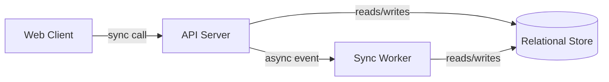
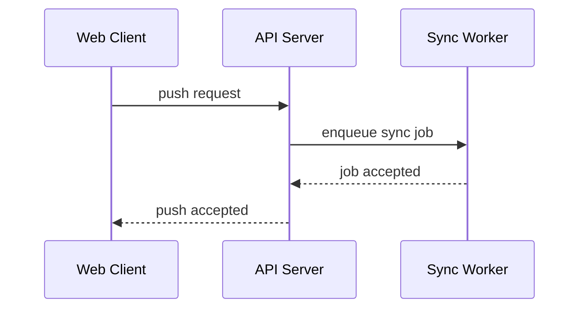

# Task: Generate ARCHITECTURE.md — Structural Blueprint of the System

## Objective

Produce an ARCHITECTURE.md that serves as the structural blueprint for the system: what components exist, what each is responsible for, how they connect, what technology each uses, which foundational decisions were made and why, and what shape the deployment takes. The document fixes the architectural *style*, inventories every component with its responsibility and deployable form, draws the topology, walks every cross-cutting scenario as a cross-component flow, indexes every architectural decision (`D-NNN`) — each one resolved as a side-output `decisions/D-{NNN}-{slug}/DECISION.md` file — sketches deployment at a 1–2-page level, names system-level quality-attribute headlines, calls out evolution seams and out-of-scope structural choices, and points readers at the sister artifacts that own surface-level detail. An agent reading this document alone can place any downstream concern (a new endpoint, a new schema, a new surface, a new component) into the correct structural slot without guessing — and can explain *why* the shape is what it is.

ARCHITECTURE.md is produce-once and read-many: every IA skill, `/interfaces`, `/data`, `/behavior`, `/quality`, `/security`, `/operations`, and most per-unit `/SPEC.md` agents read it. Treat every component name, `D-NNN` ID, and flow as a permanent commitment. The defining rule — and the commonest violation — is **structure, not surface**: this document owns *what components exist and why*, allows targeted concrete mentions where they make a structural responsibility specific, but never enumerates the wire formats, schemas, UI inventories, state machines, error taxonomies, or detailed ops that sibling artifacts own.

---

## Inputs

1. **PROPOSAL.md** (required) — § 2 Solution Thesis seeds the architectural style; § 3 Core Principles constrain every decision and often *are* the rationale on ADRs; § 4 Non-Goals bound the component inventory; § 7 Scope Boundaries anchors what must be structurally supported in v1.
2. **USE_CASES.md** (required) — § 1 Actors name who the system serves (and therefore which client-side components exist); § 2 Use Case Catalogue names every capability the components must collectively realise; § 3 Cross-Cutting Scenarios lists every `SCN-NN` that must appear as a cross-component flow in § 4 of the output.
3. **DOMAIN.md** (required) — § 2 Bounded Contexts very often map 1:1 or N:1 to components (each context owns at least one component, rarely zero); § 9 Invariants Index names constraints the component responsibilities must preserve; domain event names (`EVT-name`) are cited by flows without re-specifying wire schemas.
4. **Reference material** (optional) — tech-choice research, prior architecture docs, ops constraints, compliance notes, performance benchmarks. Cite by short name where a component choice or ADR rationale is drawn from a specific source.
5. **Existing ARCHITECTURE.md** (auto-discovered — only if refining) — if an ARCHITECTURE.md already exists at the expected path, read it fully. Every assigned `ADR-NN` is permanent. New ADRs take the next unused number. Superseded ADRs leave their ID marked `deprecated — superseded-by-ADR-MM`; never renumber, never delete-without-trace.

Read set size: 3 required + up to 2 optional — the ADD read-budget recommends ≤ 10 reads per step; this skill sits well under that. Read all three required inputs end-to-end before drafting. Omitted reading causes two specific failure modes: components without traceable responsibilities (PROPOSAL / DOMAIN drift) and missing flows (USE_CASES § 3 drift).

---

## Workflow

Architecture design proceeds in eight phases: style decision, component inventory, topology, cross-component flows, ADR harvest, deployment sketch, quality headlines and evolution, and validation. Phases are sequential; later phases feed back — if ADR harvest reveals a forced style change, revisit Phase 1 and propagate. Do not skip the validation phase even when the document "looks finished"; it is the only guard against missing scenario flows and missing ADRs.

### Phase 1: Architectural Style Decision

Read PROPOSAL.md § 2 Solution Thesis and § 3 Core Principles, USE_CASES.md § 3 Cross-Cutting Scenarios (for end-to-end shape), and DOMAIN.md § 2 Bounded Contexts. Decide the system's overall style from the fixed enum: `monolith`, `modular-monolith`, `microservices`, `client-server`, `event-driven`, `hybrid`, or `other` (use `other` only with a qualifier in § 1 prose, e.g., "peer-to-peer with a coordination server").

Force the decision with four questions:

1. **Scale envelope** — does the system need to scale components independently? If yes, leans toward `microservices` or `event-driven`; if no, `modular-monolith` is almost always right for v1.
2. **Team size** — one team → `monolith` / `modular-monolith`. Many teams with independent release cadences → `microservices` / `hybrid`.
3. **Latency vs throughput** — latency-critical hot paths (< 100 ms p99) disfavour cross-network calls; throughput-dominated async workloads favour `event-driven`.
4. **External integration topology** — many external dependencies with flaky SLAs favour `hybrid` with anti-corruption layers; self-contained systems favour `modular-monolith`.

Write § 1 Overview & Architectural Style as 2–4 paragraphs: name the style, name the dominant forcing function (scale, team size, latency, compliance, ops cost), and name at least one style that was rejected with a one-line reason ("rejected full microservices — single-team, v1 scale is 10³ RPS, cross-service latency is not budgetable"). The style name you pick lands in frontmatter `architecture_style:`.

### Phase 2: Component Inventory

Enumerate every component the system comprises. A component is a unit with a single coherent responsibility that can be deployed (or embedded) independently from its peers — a server process, a daemon, a binary, a lambda, a browser-delivered SPA, a CLI, a background worker. A library inside a component is not itself a component.

Derive candidates from three sources:
- **Bounded contexts from DOMAIN.md § 2** — each context typically maps to at least one component. A monolith may fuse many contexts into one component; microservices may split one context across components. State the mapping explicitly in each component's **Owning bounded contexts** field.
- **Actors from USE_CASES.md § 1** — every non-anonymous interactive actor implies at least one client-side component (CLI binary, SPA, mobile app, TUI). The surface scope from USE_CASES.md § 5 (`WEB`, `CLI`, `MOBILE`, `TUI`, `VOICE`) is the canonical list of client components.
- **External systems in PROPOSAL or DOMAIN.md § 10 ACLs** — anti-corruption layers against external systems may warrant their own component.

For each component write the full block: name (short, capitalised, singular — `API Server`, `Sync Worker`, `Web Client`, `CLI`), responsibility (one paragraph, in domain terms, cross-referencing DOMAIN.md bounded context names), technology stack (language, framework, major libraries — *choices*, not configuration; versions only where materially load-bearing), deployable unit (process / container / lambda / static-bundle / single-binary), owning bounded contexts (from DOMAIN.md § 2), dependencies (other components this component calls or reads from; cross-link to § 4 flows), and non-goals (what this component deliberately does not do — "the API Server does not compute pack deltas; that work lives in Sync Worker").

**Optional structural depth (per component, used only when the structure is itself architecturally meaningful):** include a **component file map** (directory tree) when the internal organisation is part of the design — TypeScript monorepos, Rust workspaces, multi-package frontends; include a **module responsibility table** mapping each notable file or directory in the tree to its one- or two-sentence responsibility when file-level routing of behaviour is part of the design; include an **internal architecture diagram** (Mermaid) when the component has non-trivial internals — concurrency models, internal pipelines, recovery flows; include a **runtime dependencies table** (capability / package / version / scope / notes) when dependency choices are themselves structurally meaningful (rich frontends, heavily-pluggable hosts). Skip any of these for components whose internals are uniform and low-information.

**Multi-repo systems.** When the system spans multiple source repositories with distinct toolchains or deployment pipelines, precede § 2 with a § 1.5 Repository Inventory — a one-row-per-repo table (`repository / language / purpose / distribution`).

Component count lands in frontmatter `components:`. Three to fifteen components is typical for v1; more than fifteen is a sign the modular-monolith / hybrid style is under-consolidated, or that responsibilities have been sliced too finely.

### Phase 3: Component Topology

Draw § 3 as a single Mermaid `flowchart LR` or `flowchart TD` diagram plus one paragraph of prose. Every component from § 2 appears as a node, cited by the exact name used in § 2 (casing, spacing, punctuation match). Edges are calls or message flows; label each edge with the *interaction kind* at the structural level — `sync call`, `async event`, `pull`, `replicates`, `delegates to`. Do not label edges with wire formats or specific methods; that belongs to INTERFACES.md.

External systems and data stores are included on the diagram but styled distinctly (subclass `external` or `store`). The prose paragraph walks the diagram top-down or left-right, calling out: (a) which components are clients vs servers vs brokers vs stores, (b) dependency direction (who depends on whom and why that direction is correct — usually "higher concepts depend on lower, never inverted"), (c) any anti-corruption layer mediating an external edge, citing it by the ACL name in DOMAIN.md § 10 where applicable.

### Phase 4: Cross-Component Flows

Walk every `SCN-NN` from USE_CASES.md § 3 — and any additional flow that is implied by the topology but missing from § 3 (rare; surface as an open question if you disagree with § 3's coverage). For each flow write a full block: flow name (short verb phrase — "Push accepted", "Subscription renewed", "OAuth login"), trigger (what kicks it off, in domain terms), participating components (list, cited by § 2 name), a Mermaid `sequenceDiagram` with one participant per participating component, numbered prose steps mirroring the diagram (3–12 steps per flow), structural failure modes (for each critical participant, what happens if it fails mid-flow — loss, retry, compensating action; name compensations at the level of "retry with exponential backoff" or "abort and return to client", not at the level of wire retry codes), and related use cases (`UC-NN` IDs plus the `SCN-NN` if the flow matches one).

The scenario-to-flow mapping is **exhaustive**: every `SCN-NN` from USE_CASES.md § 3 must have at least one flow in § 4. The flow-to-scenario mapping is **surjective-covering**: every flow ideally traces to ≥ 1 `SCN-NN`; flows with no scenario owner are permitted only when they document a critical supporting flow (health checks, graceful shutdown, warm restart) and the block carries the note `(structural supporting flow; not traced to a use case)`.

Cross-component flow count lands in frontmatter `cross_component_flows:`.

### Phase 5: Architectural Decision Harvest

Enumerate every architectural decision with *real* alternatives — alternatives a reasonable reader might have picked. Do not invent decisions for forced choices ("we chose to have a database to store state" has no alternative in context). Typical decisions: the style choice from § 1 (always; the forcing functions go into Context), language / runtime choice per component, monolith-vs-split per bounded-context, sync-vs-async per integration, in-process vs out-of-process per responsibility split, storage engine per data domain, transport / protocol family (gRPC vs REST vs GraphQL vs WebSocket — at the *family* level; specific wire details live in INTERFACES.md), orchestration vs choreography for multi-step workflows, single-region vs multi-region, self-hosted vs managed, vendor choice where it is load-bearing.

Each decision is written as a side-output `decisions/D-{NNN}-{slug}/DECISION.md` file conforming to the DECISION.md schema (id, kind: adr, title, status, context, decision, consequences with both Easier and Harder, alternatives considered with at least two rejected with reasons). Glob the existing `decisions/D-*` to compute the next unused NNN; slug is short kebab-case derived from the title. Stable IDs (`D-NNN`) are append-only — never renumber, never reuse. Deprecated decisions retain their ID with `status: superseded-by-D-MM` and the back-reference.

§ 5 of ARCHITECTURE.md itself is the index — one bullet per decision in the form `D-NNN — {title} — see decisions/D-{NNN}-{slug}/DECISION.md`, sorted by NNN. Deprecated entries remain on the index with their status noted on the line.

Decision count lands in frontmatter `decisions_indexed:`. Deprecated decisions are counted.

### Phase 6: Deployment Shape Sketch

Draft § 6 at the level of a 1–2 page sketch for orientation, not operational detail. Open § 6 with a **deployment summary table** — one row per component, columns `Component / Runs on / Key property`. Then cover, in per-environment paragraphs (dev, staging, prod — one paragraph each): cloud provider or self-hosted posture, compute kinds per component (VM, container runtime, managed service, serverless function), region strategy (single-region / multi-region / edge), and traffic ingress path at a structural level ("ingress hits a TLS-terminating load balancer in front of the API Server cluster; CLI clients bypass the load balancer and connect directly"). Name the specific provider or runtime only where it is load-bearing and settled; leave it as "managed Postgres-compatible RDBMS" when the specific vendor is ops's call.

Detail belongs to `/operations` — runbooks, config vars, CI/CD pipelines, backup / restore, on-call, capacity planning. Reference them forward as "detail in OPERATIONS.md" whenever the draft creeps into that territory.

### Phase 7: Quality Attribute Headlines, Evolution, Out-of-Scope Structure, Sister Artifacts

**§ 7 Quality Attribute Headlines.** Four to seven headline non-functional targets at the *system* level: availability (e.g., `99.9% monthly`), latency for hot paths (e.g., `p99 push accept < 2 s`), scale envelope (RPS, concurrent users, storage volume), data durability (e.g., `no single-disk loss results in data loss`), compliance bands if any (e.g., `SOC 2 Type II alignment; no PCI scope`). Headlines only; per-flow latency budgets, per-metric SLOs, and observability signal catalogues live in QUALITY.md.

**§ 8 Evolution & Extension Points.** Three to six bullets answering: where does this architecture bend if scale 10× grows? Where are the plug-in seams (new backend, new surface, new region)? What component split is *anticipated but deferred* (mark the trigger condition — "split Sync Worker into Pack Worker and GC Worker when GC CPU exceeds 30% of worker capacity")? Evolution seams that are already `D-NNN`'d need not be restated; cite the decision. This section is *architectural-evolution* — where the structure bends — distinct from feature roadmap (which lives in `roadmap/`).

**§ 9 Out-of-Scope Structure.** Two to six bullets naming architectural choices we explicitly did *not* make, each with a one-line reason. Examples: "No micro-frontends — single-team, SPA-per-surface is simpler for v1"; "No multi-region — scale envelope does not justify cross-region complexity; revisit when traffic crosses 10⁴ RPS in a single region"; "No separate analytics pipeline — event stream from § 4 is sufficient for first-year product analytics". This section is the structural analogue of PROPOSAL § 4 Non-Goals and prevents downstream agents from helpfully sketching components we chose not to build.

**§ 10 Sister Artifacts.** Anchor pointers to the documents that own surface-level detail — two or three lines each, naming the document and what surface it owns. Cover at least: `DATA.md` (database schema), `INTERFACES.md` (HTTP wire formats and event schemas), the per-surface IAs (`WEB_IA.md`, `CLI_IA.md`, `MOBILE_IA.md`, `TUI_IA.md`, `VOICE_IA.md` — only those that exist for this product), `BEHAVIOR.md` (state machines and sagas), `ERRORS.md` (error taxonomy), `SECURITY.md` (threat model), `QUALITY.md` (full SLOs and observability), `OPERATIONS.md` (runbooks, config catalogue, CI/CD), and `decisions/D-NNN-{slug}/DECISION.md` (per-decision ADRs). This section enables a reader who arrived at ARCHITECTURE.md by accident to find the right document quickly.

### Phase 8: Validation & Finalization

Verify the document holds together before finalising:

- Every component in § 2 appears as a node in § 3's topology diagram, and its name matches exactly.
- Every component in § 2 appears in at least one cross-component flow in § 4. A component mentioned nowhere in § 4 is either unused (delete) or under-documented (add the missing flow, usually a startup / warm-up / health-check flow — but then write it as a structural supporting flow per Phase 4's note).
- Every `SCN-NN` from USE_CASES.md § 3 has at least one flow in § 4. Run a checklist across § 3 of USE_CASES before finalising.
- Every architectural choice with plausible alternatives has a `D-NNN` index entry in § 5 and a corresponding `decisions/D-{NNN}-{slug}/DECISION.md` file written. The style choice from § 1 always has a decision — if you wrote only one decision and it is the style decision, consider what other choices you normalised away without examination.
- No systematic surface enumeration. Scan for full or partial inventories that duplicate sister-artifact contents — a table of every error code, every endpoint, every column, every UI page, every state machine, every config var. Targeted concrete mentions used to specify a structural responsibility ("`addCollaborator` accepts exactly one of `userId` / `username` / `email`") are allowed; full enumerations are not. When you spot an enumeration, replace it with a structural sentence and a pointer ("see ERRORS.md for the full taxonomy").
- § 10 Sister Artifacts is present and lists every sibling artifact that owns surface detail this document references.
- Frontmatter counts match the body: `components`, `decisions_indexed`, `cross_component_flows`, `open_questions`.
- `status` is `complete` if § 11 Open Questions is "All questions resolved." and `has_open_questions` otherwise.

Update frontmatter counts. Do not finalise the document with any section missing its heading.

---

## Rules

These rules govern the output document. Violations are detected by the quality checklist.

### 1. Structure, not surface

ARCHITECTURE describes *what components exist and why*. Targeted surface mentions are allowed when they make a structural responsibility specific (naming one error code, one endpoint, one URL pattern, one config flag). Systematic surface enumerations are forbidden — they belong to sister artifacts: wire formats (→ INTERFACES.md), schema (→ DATA.md), UI pages / commands / screens / intents (→ `/web-ia`, `/cli-ia`, `/mobile-ia`, `/tui-ia`, `/voice-ia`), state machines and sagas (→ BEHAVIOR.md), detailed observability and SLOs (→ QUALITY.md), threat model and auth flows (→ SECURITY.md), detailed ops / config / runbooks (→ OPERATIONS.md), error taxonomy (→ ERRORS.md). When a paragraph starts becoming a *table* of any sister-artifact concept, stop and replace it with the structural sentence plus a pointer.

### 2. Every component in at least one flow

Every component in § 2 must appear as a participating component in at least one cross-component flow in § 4. Components absent from § 4 are orphans — either the component is not needed, or the flow inventory is incomplete. A structural supporting flow (health check, warm restart) is a valid answer; silence is not.

### 3. Every cross-cutting scenario has a flow

Every `SCN-NN` from USE_CASES.md § 3 must have at least one flow in § 4. The flow title need not match the scenario title, but the flow block must cite the `SCN-NN` under **Related use cases**.

### 4. ADR for every real choice

Every architectural choice where alternatives could reasonably have been picked has an `ADR-NN` in § 5. If there was no real alternative (the forcing function is overwhelming), no ADR is needed. The style decision from § 1 always has an ADR because every style has alternatives. A document with zero ADRs is almost certainly under-documented.

### 5. Stable decision IDs, forever; decisions live in `decisions/`

`D-NNN` IDs are assigned once and never renumbered, never reused, never deleted-without-trace. Each architectural decision lives at `decisions/D-{NNN}-{slug}/DECISION.md` (written as a side output of this skill, conforming to the DECISION.md schema). § 5 of ARCHITECTURE.md is the index — one bullet per decision pointing at the file. Deprecated decisions retain their ID with `status: superseded-by-D-MM`, remain on the index with the back-reference. When refining an existing ARCHITECTURE.md, new decisions take the next unused number across the existing `decisions/` directory — never reuse a retired number.

### 6. Cite by stable ID

Citations use stable IDs, never line numbers or quoted prose: `UC-NN` for use cases, `SCN-NN` for cross-cutting scenarios, `INV-NN` for invariants, `EVT-name` for domain events, `D-NNN` for architectural decisions. Bounded context names and component names are cited verbatim (match the casing in DOMAIN.md § 2 and ARCHITECTURE.md § 2). A citation that quotes prose rather than the ID is a regeneration hazard — quotes drift; IDs do not.

### 7. Component name stability

Component names (§ 2) are cited in § 3 diagrams, § 4 flows, § 5 ADRs, and every downstream artifact. Names are short, capitalised, singular nouns or noun phrases (`API Server`, `Sync Worker`, `Web Client`, not `apiService` or `sync-workers` or `the web clients`). Once assigned, a component name is permanent — renames propagate across every downstream file.

### 8. Responsibilities in domain terms

Component responsibilities (§ 2) are stated in domain language, cross-referencing DOMAIN.md bounded context names. "The API Server accepts pushes from authenticated Collaborators and persists accepted changes against the Storage bounded context." That is a structural responsibility. "The API Server exposes `POST /repos/:id/push` accepting JSON" is a wire description — forbidden.

### 9. Consequences cover both easier and harder

Every ADR's **Consequences** field must list at least one thing that becomes *easier* and at least one thing that becomes *harder*. A consequences field listing only benefits is a sales pitch, not an ADR, and is rule-4 evidence that the alternatives were not seriously examined.

### 10. At least two alternatives in every ADR

Every ADR lists at least two alternatives considered, each with a one-line reason rejected. A single alternative is not a choice; if only one alternative is plausible, there was no real decision to record — demote to a principle or drop the ADR.

### 11. Style name from the fixed enum

The `architecture_style:` frontmatter field is one of: `monolith`, `modular-monolith`, `microservices`, `client-server`, `event-driven`, `hybrid`, `other`. Use `other` only with a qualifier in § 1 prose. § 1 names the style by the same label used in frontmatter.

### 12. Topology diagram present and consistent

§ 3 must contain a Mermaid `flowchart LR` or `flowchart TD`. Every component in § 2 appears in the diagram; every node in the diagram except externals / stores is a component in § 2. External systems and data stores are present on the diagram distinctly styled. Edges are labelled with interaction kind (`sync call`, `async event`, `pull`, `replicates`, `delegates to`) — never wire formats or specific method names.

### 13. Failure modes are structural

Every cross-component flow in § 4 has a **Failure modes** field listing what happens if each critical participant fails mid-flow. Failure descriptions are structural ("the request is abandoned and the client sees a retryable failure"). Naming a single specific error code where it disambiguates the structural behaviour is allowed; tabulating the full set of error codes is not — that taxonomy lives in ERRORS.md.

### 14. No feature-list masquerading as components

A component is a deployable unit with a coherent responsibility. A "feature" is not a component. If § 2 contains entries that are really features of a single server ("Notification Component", "Auth Component", "Billing Component" — all running inside one process), consolidate them into the actual component and record their sub-responsibilities inline. Structural components get independent deployable identity; features do not.

### 15. Single YAML frontmatter block (required)

One YAML frontmatter block at the top is required. Common fields: `skill`, `date`, `status`. Architecture-specific fields: `architecture_style`, `components`, `decisions_indexed`, `cross_component_flows`, `open_questions`. Never emit a second YAML block. Counts match the body — `components` equals the number of component entries in § 2; `decisions_indexed` equals the number of one-line entries in § 5 (each pointing to a `decisions/D-{NNN}-{slug}/DECISION.md` file written alongside this artifact); `cross_component_flows` equals the number of flow entries in § 4.

### 16. Precision over vagueness

No "appropriate", "relevant", "as needed", "etc.", "various", "and so on", "many", "some", "a few". Use exact component names, exact interaction kinds, exact `D-NNN` IDs, exact `SCN-NN` / `UC-NN` references. Unresolvable ambiguity (an unsettled monolith-vs-split question, an undecided vendor) surfaces in § 11 Open Questions.

### 17. Repository inventory for multi-repo systems

When the system spans multiple source repositories with distinct toolchains or deployment pipelines, include a § 1.5 Repository Inventory table — one row per repository, columns `repository / language / purpose / distribution`. The table appears between § 1 Overview and § 2 Components. Single-repo systems omit this section.

### 18. Optional component depth

A component entry in § 2 may include any of these optional fields when they convey architecture, not just configuration:

- **Component file map** — directory tree of the component, used when the internal organisation is itself part of the design (TypeScript monorepos, Rust workspaces, multi-package frontends).
- **Module responsibility table** — Markdown table mapping each notable file or directory in the tree to its one- or two-sentence responsibility, used when file-level routing of behaviour is part of the design.
- **Internal architecture diagram** — Mermaid diagram of the component's internals, used when the component has non-trivial concurrency, internal pipelines, or recovery flows.
- **Runtime dependencies table** — Markdown table (capability / package / version / scope / notes) used when dependency choices are themselves structurally meaningful (rich frontends, heavily-pluggable hosts).

Skip any of these for components whose internals are uniform and low-information.

### 19. Sister Artifacts section

§ 10 Sister Artifacts is required. It contains short pointers — two or three lines each — to the documents that own surface-level detail: `DATA.md`, `INTERFACES.md`, the per-surface IAs that exist for this product, `BEHAVIOR.md`, `ERRORS.md`, `SECURITY.md`, `QUALITY.md`, `OPERATIONS.md`, and `decisions/D-NNN-{slug}/DECISION.md`. Each pointer names the document and the surface it owns.

### 20. Deployment summary table

§ 6 opens with a one-row-per-component deployment summary table — columns `Component / Runs on / Key property`. Per-environment paragraph sketches (dev / staging / prod) follow the table.

---

## Output Format

```markdown
---
skill: ARCHITECTURE.md
date: {YYYY-MM-DD}
status: {complete | has_open_questions | blocked}
architecture_style: {monolith | modular-monolith | microservices | client-server | event-driven | hybrid | other}
components: {N}
decisions_indexed: {N}
cross_component_flows: {N}
open_questions: {N}
---

# ARCHITECTURE — {ProductName}

> Structural blueprint. Components, topology, flows, and decision index.
> Downstream artifacts cite components by name and decisions by `D-NNN`. Wire
> formats live in INTERFACES.md; schema in DATA.md; UI in the per-surface IAs;
> state machines in BEHAVIOR.md; ops detail in OPERATIONS.md; error codes in
> ERRORS.md; threats in SECURITY.md; SLOs in QUALITY.md; per-decision rationale
> in `decisions/D-NNN-{slug}/DECISION.md`.

## § 1. Overview & Architectural Style

{2–4 paragraphs. Name the style from the fixed enum — `monolith`,
 `modular-monolith`, `microservices`, `client-server`, `event-driven`,
 `hybrid`, or `other` (with qualifier). Name the dominant forcing function
 (scale, team size, latency, compliance, ops cost). Name at least one style
 rejected and why. The style label here matches frontmatter `architecture_style:`.}

---

## § 1.5. Repository Inventory

(Include only when the system spans multiple source repositories with distinct
 toolchains or deployment pipelines. Single-repo systems omit this section.)

| Repository | Language | Purpose | Distribution |
|---|---|---|---|
| `{repo-name}` | {language} | {purpose} | {how it ships} |

---

## § 2. Components

### `{ComponentName}`

- **Responsibility:** {one paragraph in domain terms, cross-referencing
  DOMAIN.md bounded context names. What this component owns, what work it
  performs, what guarantees it makes. Targeted concrete mentions allowed;
  no systematic enumerations of wire formats, schema, UI, or error codes.}
- **Technology stack:** {language, framework, major libraries — choices, not
  configuration; versions only where materially load-bearing}
- **Deployable unit:** {process | container | lambda | static-bundle | single-binary | embedded library}
- **Owning bounded contexts:** `{Context1}`, `{Context2}` (from DOMAIN.md § 2)
- **Dependencies:** `{OtherComponent}` (cross-link to flow in § 4 where the
  call happens), `{OtherComponent}`
- **Non-goals:** {what this component deliberately does not do — one bullet
  per non-goal, short}

#### Component file map (optional)

(Include when the component's internal organisation is part of the design.)

```
{component-root}/
├── {dir}/
│   ├── {file}
│   └── ...
└── ...
```

#### Module responsibilities (optional)

(Include when file-level routing of behaviour is part of the design. One row
 per notable file or directory; one or two sentences each.)

| File / Directory | Responsibility |
|---|---|
| `{path}` | {responsibility} |

#### Internal architecture (optional)

(Include when the component has non-trivial internals — concurrency,
 internal pipelines, recovery flows.)

```mermaid
flowchart TD
    {internal nodes and edges}
```

#### Runtime dependencies (optional)

(Include when dependency choices are themselves structurally meaningful.)

| Capability | Package | Version | Scope | Notes |
|---|---|---|---|---|
| {capability} | `{package}` | `{version}` | {scope} | {notes} |

(Repeat per component. Three to fifteen typical for v1.)

---

## § 3. Component Topology



{One-paragraph prose walking the diagram: who is client / server / broker /
 store / external; dependency direction and why; any anti-corruption layer,
 cited by the ACL name from DOMAIN.md § 10. Every component node matches
 a § 2 entry by exact name.}

---

## § 4. Cross-Component Flows

### {Flow title — short verb phrase}

- **Trigger:** {what kicks this flow off, in domain terms — "the Collaborator
  issues a push" or "the Subscription renewal timer fires"}
- **Participating components:** `{Component1}`, `{Component2}`, `{Component3}`
- **Sequence:**



- **Steps:**
  1. {Step in domain terms — "the Collaborator issues a push through the
     Web Client."}
  2. {Step}
  (3–12 numbered steps total.)
- **Failure modes:**
  - **`{Component}` fails mid-flow:** {structural behaviour — "the request is
     abandoned; the client sees a retryable failure; the job is not enqueued."}
  (Repeat for each critical participant.)
- **Related use cases:** `UC-{NN}`, `UC-{NN}` (and `SCN-{NN}` if the flow
  matches a cross-cutting scenario; if not, mark `(structural supporting
  flow; not traced to a use case)`)

(Repeat for every cross-component flow. Every `SCN-NN` from USE_CASES.md § 3
 must appear as at least one flow here.)

---

## § 5. Architectural Decision Index

(One bullet per decision, sorted by NNN. Each decision is a side-output
 `decisions/D-{NNN}-{slug}/DECISION.md` file conforming to the DECISION.md
 schema. Deprecated decisions remain on the index with their status noted.)

- `D-{NNN}` — {imperative title — "Use a modular monolith for v1"} — see `decisions/D-{NNN}-{slug}/DECISION.md`
- `D-{NNN}` — {title} — `superseded-by-D-{MM}` — see `decisions/D-{NNN}-{slug}/DECISION.md`

---

## § 6. Deployment Shape (high-level)

### Summary

| Component | Runs on | Key property |
|---|---|---|
| `{ComponentName}` | {runtime — VM, Cloud Run, Lambda, edge, static} | {load-bearing property — stateful local SSD, stateless auto-scale, edge-cached, etc.} |

### Dev

{One paragraph sketch — compute kind, region, ingress path, storage posture.
 Detail belongs to OPERATIONS.md; this is orientation only.}

### Staging

{One paragraph sketch.}

### Prod

{One paragraph sketch.}

(Name the specific provider / runtime only where load-bearing and settled;
 leave vendor as "managed {kind}" when it is ops's call.)

---

## § 7. Quality Attribute Headlines

- **Availability:** {target — e.g., `99.9% monthly uptime for Prod ingress`}
- **Latency (hot path):** {target — e.g., `p99 push accept < 2 s at 10³ RPS`}
- **Scale envelope:** {target — e.g., `10³ concurrent pushes, 10⁴ read RPS,
  10 TiB stored; tested at 5× these targets in staging`}
- **Data durability:** {target — e.g., `no single-disk loss results in data
  loss; recovery point objective ≤ 5 min`}
- **Compliance:** {band or `none applicable for v1`}

(Four to seven headline targets. Per-flow budgets and per-metric SLOs live
 in QUALITY.md.)

---

## § 8. Evolution & Extension Points

- **{Seam or anticipated split}** — {trigger condition — "split Sync Worker
  into Pack Worker and GC Worker when GC CPU exceeds 30% of worker capacity";
  cite `ADR-NN` if the seam is already recorded}

(Three to six bullets. Already-ADR'd seams may be one-line cites.)

---

## § 9. Out-of-Scope Structure

- **{Structural choice not made}** — {one-line reason — "No multi-region;
  scale envelope does not justify cross-region complexity. Revisit when
  Prod traffic crosses 10⁴ RPS in a single region."}

(Two to six bullets. The structural analogue of PROPOSAL § 4 Non-Goals.)

---

## § 10. Sister Artifacts

- **DATA.md** — {what surface it owns, e.g., "PostgreSQL schema, indexes, access patterns, migration list"}
- **INTERFACES.md** — {e.g., "HTTP wire formats, request/response shapes, event schemas"}
- **WEB_IA.md** — {e.g., "URL strategy, page inventory, navigation, per-page blueprints"}
- **CLI_IA.md** — {e.g., "command grammar, exit codes, per-command blueprints"}
- **{other surface IAs that exist}** — {what each owns}
- **BEHAVIOR.md** — {e.g., "state machines per aggregate, sagas, idempotency keys"}
- **ERRORS.md** — {e.g., "error code registry, classification tree, response shape"}
- **SECURITY.md** — {e.g., "threat model, mitigations, auth/authz flows"}
- **QUALITY.md** — {e.g., "logging standard, metrics catalogue, SLOs, performance budgets"}
- **OPERATIONS.md** — {e.g., "deployment topology, CI/CD, config catalogue, runbook"}
- **`decisions/D-NNN-{slug}/DECISION.md`** — per-decision rationale, indexed in § 5

---

## § 11. Open Questions

- [ ] {Question — e.g., "Should the Sync Worker share the API Server's
      relational store or own a dedicated one? Isolation is cleaner; shared
      access is simpler for v1; the choice depends on whether we anticipate
      sync-driven write contention exceeding 20% of DB capacity."}
  - **Option A:** {description} — {tradeoff}
  - **Option B:** {description} — {tradeoff}
  - **Recommendation:** {suggestion and reasoning}

(If none: "All questions resolved.")
```

---

## Scope

### In scope

- Architectural style decision and rationale
- Repository inventory (when multi-repo)
- Component inventory — name, responsibility, technology stack, deployable unit, owning bounded contexts, dependencies, non-goals; plus optional component file map, module responsibility table, internal architecture diagram, and runtime dependencies table when structurally meaningful
- Component topology (Mermaid flowchart) with interaction-kind labelled edges and external systems / stores distinctly styled
- Cross-component flows — one per `SCN-NN` from USE_CASES.md § 3 at minimum, each with Mermaid sequence diagram, numbered prose steps, structural failure modes, and related use cases
- Architectural Decision Index (`D-NNN` index pointing to side-output `decisions/D-NNN-{slug}/DECISION.md` files) for every decision with real alternatives
- High-level deployment summary table plus per-environment paragraph sketches (dev, staging, prod)
- Headline quality-attribute targets (availability, latency, scale envelope, data durability, compliance)
- Evolution seams and anticipated splits with trigger conditions
- Explicit out-of-scope structural choices with reasons
- Sister Artifacts pointers to documents owning surface-level detail
- Genuinely ambiguous decisions surfaced in § 11 Open Questions

### Out of scope

- Wire formats, request / response shapes, endpoint paths, JSON / protobuf schemas, event wire schemas — owned by `/interfaces`
- Database schema, indexes, access patterns, migration strategy — owned by `/data`
- UI surfaces (pages, commands, screens, views, intents) — owned by IA skills (`/web-ia`, `/cli-ia`, `/mobile-ia`, `/tui-ia`, `/voice-ia`)
- State machines, sagas, compensating actions, per-entity lifecycles — owned by `/behavior`
- Detailed observability signals, per-flow SLOs, per-flow latency budgets, metric catalogues — owned by `/quality`
- Threat model, per-actor auth flows, authorisation matrix, security controls — owned by `/security`
- Runbooks, config variable catalogue, CI/CD, backup / restore, on-call, capacity planning — owned by `/operations`
- Error taxonomy, error codes, error categories — owned by `/errors`
- Per-unit specs, plans, implementations — owned by the per-unit pipeline (`/SPEC.md` through `/RECONCILIATION.md`) under `units/<area>/u<NN>/`
- Full glossary, entities, aggregates, value objects, invariants, bounded contexts themselves — owned by `/domain`
- Use case catalogue, cross-cutting scenario narratives, priority milestones, surface mapping matrix — owned by `/use-cases`

---

## Quality Checklist

- [ ] Output file has valid YAML frontmatter with all required fields (`skill`, `date`, `status`, `architecture_style`, `components`, `decisions_indexed`, `cross_component_flows`, `open_questions`)
- [ ] No placeholders, TODOs, or vague language ("appropriate", "relevant", "as needed", "etc.", "various", "and so on", "many", "some")
- [ ] § 11 Open Questions is present (empty with "All questions resolved." or with genuine ambiguities only)
- [ ] Output is self-contained — readable and actionable without opening other files
- [ ] All required sections (§ 1, § 2, § 3, § 4, § 5, § 6, § 7, § 8, § 9, § 10, § 11) are present with their exact headings; § 1.5 Repository Inventory is present iff the system is multi-repo
- [ ] `architecture_style` frontmatter value is one of: `monolith`, `modular-monolith`, `microservices`, `client-server`, `event-driven`, `hybrid`, `other`
- [ ] § 1 names the architectural style using the same label as frontmatter, names the dominant forcing function, and names at least one style rejected with a reason
- [ ] Every component in § 2 has all required fields: responsibility, technology stack, deployable unit, owning bounded contexts, dependencies, non-goals; optional fields (component file map, module responsibility table, internal architecture diagram, runtime dependencies table) are included only when structurally meaningful
- [ ] § 3 contains a Mermaid `flowchart LR` or `flowchart TD` with every component from § 2 appearing as a node using the exact § 2 name
- [ ] Every edge in the § 3 diagram is labelled with an interaction kind (`sync call`, `async event`, `pull`, `replicates`, `delegates to`) — never a wire format or method name
- [ ] Every component in § 2 participates in at least one flow in § 4
- [ ] Every `SCN-NN` from USE_CASES.md § 3 has at least one flow in § 4 with the `SCN-NN` cited in **Related use cases**
- [ ] Every flow in § 4 has trigger, participating components, Mermaid sequence diagram, numbered steps (3–12), failure modes, and related use cases
- [ ] Every entry in § 5 has the form `D-NNN — {title} — see decisions/D-NNN-{slug}/DECISION.md`, and a corresponding `decisions/D-NNN-{slug}/DECISION.md` file has been written conforming to the DECISION.md schema (id, kind: adr, title, status, context, decision, consequences with Easier and Harder, alternatives considered with at least two rejected with reasons)
- [ ] `D-NNN` IDs are append-only — no renumbering; deprecated decisions retain their ID with `status: superseded-by-D-MM` and remain on the index
- [ ] The style choice from § 1 has a corresponding `D-NNN` entry in § 5
- [ ] § 6 opens with the deployment summary table and then covers dev, staging, and prod in at most one paragraph each — no runbook-level detail
- [ ] § 7 lists 4–7 headline quality-attribute targets with numbers, not qualitative adjectives
- [ ] § 8 names evolution seams or anticipated splits with trigger conditions (architectural-evolution, distinct from feature roadmap); § 9 names ≥ 2 explicit out-of-scope structural choices with reasons
- [ ] § 10 Sister Artifacts is present and points at every sibling artifact whose surface this document references
- [ ] No systematic surface enumeration anywhere — no full or partial inventories of error codes, endpoints, columns, UI pages, state machines, or config vars; targeted concrete mentions used to specify a structural responsibility are allowed
- [ ] Citations use stable IDs (`UC-NN`, `SCN-NN`, `INV-NN`, `EVT-name`, `D-NNN`), never line numbers or quoted prose
- [ ] Frontmatter counts (`components`, `decisions_indexed`, `cross_component_flows`, `open_questions`) match the body exactly
- [ ] `status` is `complete` if § 11 is "All questions resolved." and `has_open_questions` otherwise
- [ ] Document length is within the 1000–2000 line target (hard cap 2000)
