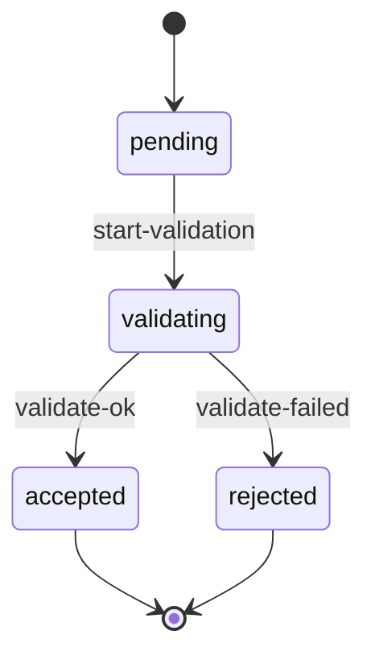

# State Machine and Saga Block Templates

Every entry in § 1 State Machines and § 2 Sagas of BEHAVIOR.md follows the exact
block structure below. Apply these templates verbatim — field order, heading
level, bullet labels, table column order, and fence style all matter because
downstream agents (`/quality`, `/security`, `/operations`, `/spec`,
`/system-verify`) parse these blocks to derive guard checks, compensation
handlers, retry policies, and threat-on-transition analyses.

---

## State Machine Block

```markdown
### `SM-{entity-name}` — `{EntityName}` state machine

- **Entity:** `{AggregateOrEntityName}` (from DOMAIN § 4 / § 5)
- **Owning context:** `{ContextName}` (from DOMAIN § 2)
- **States:** `{state-one}`, `{state-two}`, `{state-three}` (short, lowercase-hyphen)
- **Initial state:** `{state-name}` — assigned when `{triggering action in domain terms}`
- **Terminal states:** `{state-one}`, `{state-two}` — or `(none — this SM has no terminal states, every instance cycles)`
- **Use cases:** `UC-{NN}`, `UC-{NN}`

#### Transition table

| From | Event / Action | Guard | To | Effects | Invariants preserved |
|------|----------------|-------|-----|---------|----------------------|
| `{state}` | `{action-name or EVT-name}` | `{precondition in domain terms — or "always"}` | `{state}` | `emit EVT-{name}` / `release {resource}` / `(none)` | `INV-{NN}`, `INV-{NN}` |

(One row per legal transition. Every cell populated — no blanks, no `n/a`.
 `Effects` lists every observable outcome of the transition in domain terms.
 `Invariants preserved` names every `INV-NN` the transition must not break.)

#### Illegal transitions

| From | Event / Action | Error emitted |
|------|----------------|---------------|
| `{state}` | `{action-name}` | `{ERR_CODE}` (from ERRORS.md § 3) |

(One row per (from-state, action) pair explicitly rejected. Every row names
 an `ERR_CODE` from ERRORS.md — silent rejection is forbidden. If the SM
 has no illegal transitions: "No illegal transitions — every unlisted
 (state, action) pair is reachable via the transition table.")

#### Diagram

```mermaid
stateDiagram-v2
  [*] --> {initial-state}
  {state} --> {state}: {action-name}
  {state} --> {state}: {action-name}
  {state} --> [*]
```
```

**Field rules:**

- `SM-{entity-name}` is kebab-case using the entity's canonical DOMAIN glossary name (`SM-repository`, `SM-push`, `SM-subscription`). Assigned once; never renumbered.
- State names are short, lowercase, hyphen-separated (`pending`, `active`, `awaiting-review`). Never camelCase, never spaces, never enum numbers.
- Every state must appear either as a terminal state or as a `From` in at least one transition row. Unreachable states are modelling errors.
- Every state listed in `States:` must appear somewhere in the transition table (as `From` or `To`) or as initial / terminal.
- Every `Event / Action` is either a domain action verb (`submit`, `cancel`, `approve`) or a domain event (`EVT-name` from INTERFACES § 7 that triggers the transition in-process).
- `Guard` is expressed in domain terms only — no SQL, no HTTP codes, no type checks. "payload valid per DOMAIN VO rules" is acceptable; "`if request.body != null`" is not.
- `Effects` list emitted events by `EVT-name` only (not inline payloads; payloads live in INTERFACES § 7).
- Every `INV-NN` in `Invariants preserved` must exist in DOMAIN § 9.
- Every `ERR_CODE` in the illegal-transition table must exist in ERRORS.md § 3.
- The mermaid block must parse. Use `stateDiagram-v2` with `[*]` for initial and terminal pseudostates.

---

## Saga Block

```markdown
### `SAGA-{name}` — `{HumanDescription}`

- **Trigger:** `{user action "command X via EP-name" | scheduled "daily at 00:00 UTC" | event EVT-name | state-machine transition SM-entity: from → to}`
- **Participating components:** `{ComponentOne}`, `{ComponentTwo}` (from ARCHITECTURE § 2)
- **Participating aggregates:** `{AggregateOne}`, `{AggregateTwo}` (from DOMAIN § 5)
- **Idempotency key:** `{key-name from § 3}` — scope `{per-{scope}}`; replay within window returns `{outcome}`
- **Use cases:** `UC-{NN}`, `UC-{NN}`

#### Happy path

1. `{Step one description}` — component `{ComponentName}`; calls `EP-{name}` (if HTTP) or invokes `{DomainService}` (if in-process).
2. `{Step two description}` — component `{ComponentName}`; calls `EP-{name}`.
3. `{...}`
n. `{Terminal step}` — success condition: `{observable outcome in domain terms, e.g., "SM-push is in state 'accepted' and EVT-push-accepted has been emitted"}`.

#### Compensations

| Step | Compensation |
|------|--------------|
| `1` | `{compensating action in domain terms, or "none (read-only)"}` |
| `2` | `{compensating action}` |

(One row per step in the happy path. Every step has a compensation entry,
 even if it is `none (read-only)`. Missing compensations are modelling bugs,
 not acceptable silence.)

#### Timeouts & retries

- **Per-step timeout:** `{duration — e.g., "5s", "30s", "2m"}`. Exceeded → `{action: compensate preceding steps | retry the step up to {N} times | fail the saga and emit EVT-{name}-failed}`.
- **Overall timeout:** `{duration}`. Exceeded → `{action}`.
- **Retry policy (transient failures):** exponential backoff, base `{duration}`, max `{N}` attempts, jitter `{yes | no}`. Applies only to `ERR_CODE`s classified `retryable: yes-with-backoff` in ERRORS.md § 3.
- **Non-retryable errors:** `{ERR_CODE}`, `{ERR_CODE}` — saga fails immediately and runs compensations for completed steps.

#### Failure modes

| Where it can fail | Behaviour | User-visible outcome | Observable signal |
|-------------------|-----------|----------------------|-------------------|
| `{step number or phase}` | `{compensate / retry / fail-and-alert}` | `{what the user sees — error code / state transition / timeout message}` | `{metric, log line, or event emitted}` |

(One row per meaningful failure point. `Observable signal` names the
 concrete signal operators and QUALITY.md will rely on.)
```

**Field rules:**

- `SAGA-{name}` is kebab-case naming the workflow in domain terms (`SAGA-push`, `SAGA-subscription-renewal`, `SAGA-fork-creation`). Assigned once; never renumbered.
- `Trigger` is exactly one of the four forms listed. Multi-trigger sagas split into separate entries or declare a discriminator trigger.
- Every component in `Participating components` must appear in ARCHITECTURE.md § 2. Every aggregate in `Participating aggregates` must appear in DOMAIN.md § 5.
- `Idempotency key` must match a key registered in § 3 of BEHAVIOR.md verbatim; the § 3 row's `Used by` column names this saga reciprocally.
- Happy-path steps are numbered (`1`, `2`, …, `n`). The terminal step's `success condition` is stated in domain terms — state names from an SM, or an emitted `EVT-name`, or an observable aggregate invariant.
- Every HTTP step cites an exact `EP-name` from INTERFACES § 6. Every in-process step names a domain service or aggregate method from DOMAIN § 8.
- Every happy-path step has a row in `Compensations`, even when the compensation is `none (read-only)`. No gaps.
- `Per-step timeout` and `Overall timeout` are explicit durations. `(none)` is permitted only with explicit rationale — e.g., `(none — step is bounded by external SLA of downstream EP-name)`.
- `Retry policy` cites `ERR_CODE` classes from ERRORS.md; retryability is never redefined here, only referenced.
- `Failure modes` lists every place a step can fail and the observable signal operators will see. Silent failures are forbidden — every mode has a signal.

---

## Worked Example — State Machine

```markdown
### `SM-push` — `Push` state machine

- **Entity:** `Push` (from DOMAIN § 4)
- **Owning context:** `Access`
- **States:** `pending`, `validating`, `accepted`, `rejected`
- **Initial state:** `pending` — assigned when a client submits a push via `EP-push-create`
- **Terminal states:** `accepted`, `rejected`
- **Use cases:** `UC-04`, `UC-11`

#### Transition table

| From | Event / Action | Guard | To | Effects | Invariants preserved |
|------|----------------|-------|-----|---------|----------------------|
| `pending` | `start-validation` | pack objects received | `validating` | `(none)` | `INV-07` |
| `validating` | `validate-ok` | pack passes integrity check and `parentSha` matches current branch tip | `accepted` | `emit EVT-push-accepted`, advance branch ref | `INV-07`, `INV-12` |
| `validating` | `validate-failed` | integrity check failed or `parentSha` mismatch | `rejected` | `emit EVT-push-rejected` | `INV-07` |

#### Illegal transitions

| From | Event / Action | Error emitted |
|------|----------------|---------------|
| `accepted` | `start-validation` | `PUSH_ALREADY_FINAL` |
| `rejected` | `start-validation` | `PUSH_ALREADY_FINAL` |
| `pending` | `validate-ok` | `PUSH_NOT_VALIDATING` |
| `pending` | `validate-failed` | `PUSH_NOT_VALIDATING` |

#### Diagram


```

---

## Worked Example — Saga

```markdown
### `SAGA-push` — Client push accepted end-to-end

- **Trigger:** user action "client calls `EP-push-create`"
- **Participating components:** `Access Service`, `Git Engine`, `Storage Service`
- **Participating aggregates:** `Push`, `Repository`, `BranchRef`
- **Idempotency key:** `push_id` — scope `per-repo`; replay within window returns the cached `EP-push-create` response.
- **Use cases:** `UC-04`

#### Happy path

1. Client submits push — `Access Service` receives via `EP-push-create`; creates `Push` aggregate in `SM-push: pending`.
2. Validate pack — `Access Service` invokes `Git Engine` via `EP-engine-validate-pack`; on success transitions `SM-push: pending → validating`.
3. Advance branch ref — `Access Service` transitions `SM-push: validating → accepted`; emits `EVT-push-accepted`.
4. Durability commit — `Storage Service` (subscriber of `EVT-push-accepted`) writes pack to durable store.
5. Terminal — success condition: `SM-push` is in state `accepted` and `EVT-push-accepted` has been observed by `Storage Service`.

#### Compensations

| Step | Compensation |
|------|--------------|
| `1` | delete `Push` aggregate; release advisory lock on `repoId` |
| `2` | transition `SM-push: validating → rejected`; emit `EVT-push-rejected` |
| `3` | revert branch ref to `parentSha`; emit `EVT-push-reverted` |
| `4` | Storage Service exposes cleanup via scheduled reconciliation; no synchronous compensation |

#### Timeouts & retries

- **Per-step timeout:** `30s` for steps 1–3. Exceeded → compensate preceding steps and fail the saga with `PUSH_TIMEOUT`.
- **Overall timeout:** `2m` from `EP-push-create` receipt.
- **Retry policy (transient failures):** exponential backoff, base `500ms`, max `3` attempts, jitter `yes`. Applies to `DEPENDENCY_FAILURE`, `OVERLOAD` (both classified `yes-with-backoff` in ERRORS.md).
- **Non-retryable errors:** `INVALID_PACK`, `PUSH_CONFLICT`, `AUTH_REQUIRED`, `FORBIDDEN` — saga fails immediately; steps 1 compensations run.

#### Failure modes

| Where it can fail | Behaviour | User-visible outcome | Observable signal |
|-------------------|-----------|----------------------|-------------------|
| Step 2 (pack invalid) | fail-and-compensate | `EP-push-create` returns `INVALID_PACK` (`400`) | `EVT-push-rejected` emitted; `push.rejected` metric ticks |
| Step 2 (engine unavailable) | retry with backoff, then fail | `EP-push-create` returns `DEPENDENCY_FAILURE` (`503`) | `engine.availability` SLO alert |
| Step 3 (concurrent ref advance) | fail-and-compensate | `EP-push-create` returns `PUSH_CONFLICT` (`409`) | `push.conflict` metric ticks |
| Step 4 (storage write lag) | asynchronous reconciliation | client sees success; eventual consistency within `{SLO}` | `EVT-push-accepted` age metric |
```
