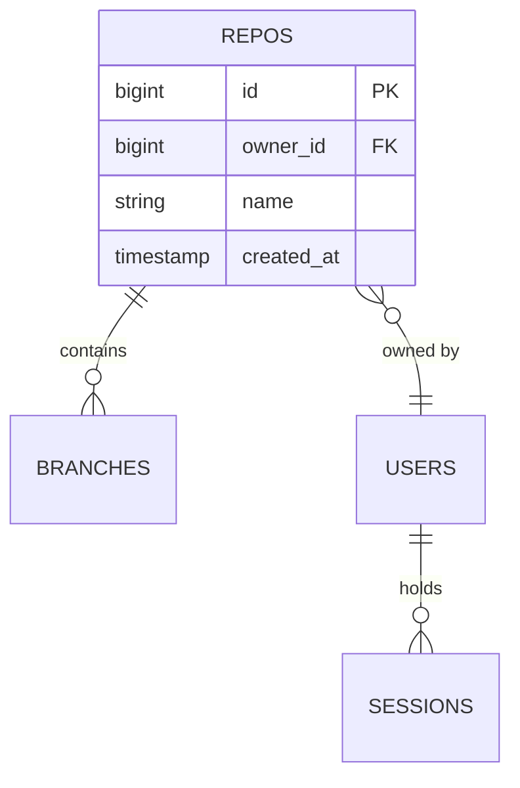

# Task: Generate DATA.md — Persistent-Data Layer

## Objective

Produce a DATA.md that serves as the single source of truth for the system's persistent-data layer: which datastore(s) the system uses and why, the ER (or collection) diagram, the schema for every table or collection with column-by-column typing and constraints, every index with its rationale, the ordered list of migrations, the retention and deletion policy per table, the sensitive-data inventory per column, and the consistency and concurrency strategies applied across entities. Crucially, DATA.md extends traditional database documentation with an **access-patterns section** that maps every query the system actually runs to the index that serves it — schemas without access patterns are under-specified. An agent reading this document alone can explain, for any query the system issues, which index serves it and at what cost class; for any table, which aggregate it persists and which invariants its constraints enforce; for any column holding sensitive data, its classification, masking rule, and encryption posture.

DATA.md is read by `/operations` (for migration sequencing, retention runbooks, and backup posture), `/security` (for the sensitive-data inventory), every per-unit `/SPEC.md` that touches persistence (to draw typing and constraints from a single source), `/code-review` for conformance against the registered schema, and `/system-verification` during bootstrap. The defining discipline — and the commonest violation — is **every query is indexed or explicitly accepted as a scan**: a schema that lists columns and indexes without the access-pattern map is half a design, because it does not prove the indexes are the right ones. Co-locating schema, indexes, and access patterns in one artifact is the deliberate read-pattern optimisation that makes this skill exist.

---

## Inputs

1. **DOMAIN.md** (required) — § 2 Bounded Contexts supply owning-context values for each table; § 4 Entities and § 5 Aggregates supply the conceptual targets that schema persists (every table maps to at least one aggregate or entity); § 9 Invariants Index supplies `INV-NN` references for invariants enforced at the database level (uniqueness, foreign-key integrity, check constraints).
2. **ARCHITECTURE.md** (required) — § 2 Components and § 5 ADRs pin the datastore technology choice (Postgres, DynamoDB, MySQL, Mongo, SQLite, Redis, S3, …). The `ADR-NN` that chose the storage engine is cited verbatim in § 1 Datastore Overview. Multi-store architectures (a relational primary plus a blob store plus a cache) produce multiple datastore sub-blocks.
3. **Existing schema / migrations** (optional, auto-discovered — only if refining) — if migration files (e.g., `migrations/`, `db/migrations/`, `priv/repo/migrations/`, Flyway, Alembic, ActiveRecord, Knex) are present, read them fully. Every shipped migration appears in § 6 with its original filename preserved. Do not re-describe shipped migrations from memory — quote their actual effect.
4. **Existing queries / ORM code** (optional, auto-discovered — access-pattern inference) — if source trees contain SQL (`.sql` files, query-builder DSL, `EXPLAIN` artefacts), ORM model code (repositories, DAOs, Active Record models), or data-access layers, scan them to harvest the queries the system actually runs. Each harvested query maps to a row in § 5 with its origin file and function cited in the **Uses index** column's footnote.
5. **Existing DATA.md** (auto-discovered — only if refining) — if a DATA.md already exists at the expected path, read it fully. Shipped migration filenames are permanent; never rename or reorder them. Column names, table names, and index names that are already live are load-bearing — changing them requires a migration row, not a silent edit.

Read set size: 2 required + up to 3 auto-discovered. Read both required inputs end-to-end; for refinement, read every migration file and every data-access source file before drafting. Omitted reading causes two specific failure modes: tables with no owning aggregate (DOMAIN drift) and indexes with no serving query (orphan indexes — the schema is lying about which queries matter).

---

## Workflow

Data-layer design proceeds in nine phases: datastore anchoring, aggregate-to-schema mapping, index inventory, **access-pattern mapping** (the critical phase), migration enumeration, retention and deletion, sensitive-data inventory, consistency and concurrency, and validation. Phases are sequential but revisit earlier phases when a later one reveals a missing index, a missing migration, or a mis-sized constraint. Do not skip the access-patterns phase — it is the phase that proves the schema is the right schema.

### Phase 1: Datastore Anchoring

Read ARCHITECTURE.md § 2 and § 5 to fix the datastore technology. For each distinct datastore the system uses (typically one primary relational or document store, optionally a blob store, a cache, a message queue's durable state, a search index), record: kind (`postgres`, `mysql`, `dynamodb`, `mongo`, `sqlite`, `redis`, `s3`, `elasticsearch`, `cassandra`, …), version pinned where load-bearing, connection model (pooled / per-request / serverless), transactional semantics (single-row atomic / single-shard / multi-shard with 2PC / none), and consistency guarantees this datastore provides out of the box (read-after-write, snapshot isolation, eventual, tunable quorum). Cite the originating `ADR-NN` from ARCHITECTURE.md § 5.

The primary datastore kind lands in frontmatter `datastore:`. If multiple datastores exist, `datastore:` carries the primary (the one that owns aggregate persistence); secondary stores (cache, blob) are declared in § 10 Non-Relational Side and do not contribute to `datastore:`.

### Phase 2: Aggregate-to-Schema Mapping

For each aggregate in DOMAIN.md § 5 (and for entities in § 4 that persist independently), choose the schema representation:

- **One-table-per-aggregate** — default for relational stores. The aggregate root becomes a table; member entities with cardinality 1 may be inlined as columns or as a composite type; member entities with cardinality N become child tables with a foreign key on the root's primary key. Cite the **Represents** field in every table with the aggregate name.
- **Single-table with type discriminator** — appropriate when polymorphic aggregates share many columns (classic `accounts` table holding both `IndividualAccount` and `OrganisationAccount`). Record the discriminator column and the per-discriminator invariants.
- **Document-per-aggregate** — default for document stores. The aggregate root plus its value-object members serialise to one document; member entities with cardinality N live as embedded arrays or as a separate collection with a parent reference.
- **Event-sourced** — the aggregate persists as an append-only sequence of events; current-state projections live as separate tables or materialised views. Rare; specify only when ARCHITECTURE.md § 5 has an ADR for it.

For each table or collection write the full block: name (`snake_case` for relational, typically `plural_noun`; document stores follow their idiomatic convention), **Represents** (aggregate or entity from DOMAIN.md §§ 4–5), **Owned by** (bounded context from DOMAIN.md § 2), **Invariants enforced at the DB level** (every `INV-NN` from DOMAIN.md § 9 that is enforceable via uniqueness / FK / check constraints at the storage layer), columns, constraints, and triggers. Column table columns: name, type, nullable (`yes` / `no`), default, one-sentence description, and the `INV-NN` reference when the column carries an invariant (primary keys, uniqueness keys, foreign keys, monotonic counters).

Orphan tables — tables that do not map to any DOMAIN aggregate or entity — reveal unmodeled domain concepts. Surface them as an open question rather than inventing a bounded-context owner.

Table / collection count lands in frontmatter `tables_or_collections:`.

### Phase 3: Index Inventory

Every index the schema creates lands in § 4 with: **Name** (convention `idx_<table>_<cols>` for secondary indexes, `pk_<table>` for primary keys, `uq_<table>_<cols>` for unique constraints — match the real naming convention of the project if one is already in use), **Table**, **Columns** (in order — order matters for composite indexes because the prefix rule governs which queries use the index), **Type** (`btree`, `hash`, `gin`, `gist`, `brin`, `composite`, `covering`, `partial`, `expression` — name the flavour that matters; for document stores use the driver's terminology), **Purpose / rationale** (one sentence naming *which access pattern from § 5 this serves*, cited by row number or query summary — the linkage is mandatory), **Expected cardinality / selectivity** (back-of-envelope — "high selectivity: ~10³ distinct values across ~10⁶ rows", or "low cardinality: 3 distinct states; used only as secondary predicate").

The single unbreakable rule for this phase: **every index must appear as the serving index for at least one row in § 5**. Inversely, every index in § 4 must be cited from at least one § 5 row — orphan indexes waste write-budget and lie about which queries matter. Resolve the harvesting in Phase 4 before finalising; if an index has no serving query, either add the query (if the code runs it and Phase 4 missed it) or drop the index (if no code runs it). Do not carry orphan indexes forward.

Index count lands in frontmatter `indexes:`.

### Phase 4: Access-Pattern Mapping (critical)

This is the phase that makes DATA.md different from traditional database docs. Every query the system runs — every `SELECT`, `UPDATE` predicate, `DELETE` predicate, document find, secondary-index lookup, range scan, aggregation — lands as a row in § 5.

Harvest queries from four sources:

- **Use cases from USE_CASES.md** (reached through DOMAIN — the aggregate that a UC-NN operates on tells you the tables touched). Every use case implies at least one read and at least one write path.
- **API endpoints from INTERFACES.md** (when INTERFACES is available upstream). Each `EP-name` has an intent; the intent implies a query. `GET /repos/:owner/:name` ⇒ "find repo by owner+name" ⇒ one row.
- **Existing source code** (auto-discovered — the highest-signal source). Scan repositories / DAOs / query modules: every `Repo.find_by`, every parameterised SQL literal, every query-builder chain maps to a row.
- **Background workflows from BEHAVIOR.md** (when available) — cron jobs, dead-letter scans, reconciliation sweeps. These are frequently missed in query-harvest; they are often the queries that *break* under production scale.

For each query write a row in the § 5 table: **Query** (prose one-liner or SQL sketch — e.g., "Find repo by owner+name" or `SELECT * FROM repos WHERE owner_id = $1 AND name = $2`; sketches are acceptable and often clearer than prose — include when the shape matters), **Frequency** (one of `per-request` / `frequent` / `periodic` / `rare` — four-step enum, not prose; `per-request` means every hot-path request executes it, `frequent` means ≥ 1 per operator action, `periodic` means scheduled or background, `rare` means admin-or-support only), **Expected rows** (result-set cardinality — `1`, `≤ 10`, `≤ 100`, `≤ 10³`, `≤ 10⁶`, or `full-scan` for administrative scans), **Uses index** (the index name from § 4 that serves this query — or `(table scan)` with justification in the row's trailing note), **Cost class** (one of `O(1)` / `O(log n)` / `O(n)` / `O(n log n)` — back-of-envelope complexity against the expected result-set; a "frequent" query with cost class `O(n)` on a `n = 10⁶` table is a design bug, surface immediately).

Rules enforced in this phase:

- **Every query must use an index or be explicitly accepted as a scan.** `(table scan)` is a valid answer only with justification — "small table, ≤ 100 rows, indexing would cost more than it saves"; "admin-only periodic scan; acceptable under 1 s on production data volumes". Scan without justification is a design bug.
- **No orphan indexes.** Every index in § 4 must appear as "Uses index" in ≥ 1 row of § 5. If an index has no serving query, Phase 4 missed the query (revisit) or the index is unjustified (drop).
- **Every cited query must match a real code path.** When refining, the "Uses index" cell carries an inline footnote with the file and function where the query lives (`repos_repository.go::FindByOwnerName`, `src/repositories/RepoRepository.ts::findByOwnerName`). Speculative queries — queries invented to justify an index — are forbidden. If a query does not yet have a code path, it belongs in an open question or is deleted.
- **High-frequency queries get high-cardinality indexes.** A `per-request` row with an `Uses index` that has low selectivity (< 10² distinct values) is a design smell; surface as a row note or open question.

Access-pattern count lands in frontmatter `access_patterns:`.

### Phase 5: Migration Enumeration

List every migration in § 6 in the order it applies, first to last. For each: **Filename** (exact on-disk filename — `20240815120000_create_repos.sql`, `V001__create_repos.sql`, `0001_create_repos.py`, whichever convention the project uses; match the existing migration tool's convention when refining), **What it changes** (schema delta in prose — "creates `repos` with primary key `id`, unique index on `(owner_id, name)`, FK to `users(id)`"), **Safety** (reversible? zero-downtime? requires lock? — state each explicitly; `reversible: yes/no`, `zero-downtime: yes/no`, `lock: none/access-exclusive/row`), **Backfill** (needed? strategy? — `no backfill required` / `backfill via app-level script after migration` / `backfill inline in migration SQL; transactional`; backfills over large tables deserve a one-line note on estimated runtime), **Ordering constraints** (must run after migration X / before migration Y — typically trivial once migrations are ordered on filename, but surface explicitly when feature flags or deploy coordination matters).

Explicitly identify the initial schema migration (`V001` or equivalent) as "initial schema". State the convention future migrations follow in the § 6 preamble so contributors know how to add one: filename format, location, tool command to generate.

**Migrations are append-only.** Never edit a shipped migration; always add a new one. This is rule 6 in the Rules section and is a hard constraint.

Migration count lands in frontmatter `migrations_listed:`.

### Phase 6: Retention, Deletion, and Sensitive-Data Inventory

**§ 7 Retention & Deletion.** For each table (and for each column where per-column retention differs from the table's default): **Retention period** (calendar duration — `180 days`, `7 years`, `indefinite`, `until aggregate deletion`; never "as needed"), **Deletion strategy** (`hard delete` — row removed; `soft delete` — tombstone column marks the row inactive; `archive-then-delete` — row copied to an archive table before removal), **GDPR / regulatory requirements** (`right-to-erasure: hard delete within 30 days of request`; `no PII; not in GDPR scope`; cite the regulation by name — GDPR, HIPAA, PCI-DSS, SOX — when applicable), **Backup retention** (separate from live retention — typically "daily backups retained 30 days; point-in-time-recovery window 7 days"; cross-link to OPERATIONS.md for backup automation).

**§ 8 Sensitive Data Inventory.** For every column holding PII, secrets, financial data, health data, or other regulated data: `Table.column`, **Classification** (one of `PII` / `secret` / `financial` / `health` / `other-regulated`), **Masking in logs** (the redaction rule — typically `[REDACTED]` for the entire value, or `last-4-only` for cards, or `hashed` for identifiers needing correlation without reversibility), **Encryption at rest** (`native` — the datastore's native encryption; `column-level` — the column is encrypted with a dedicated key; `application-layer` — the application encrypts before storing; `none` — justify), **Who can read** (the role or principal from SECURITY.md that is authorised — "operator-with-support-role", "service-self-only", "audit-reader"; SECURITY.md owns the full role matrix, this document cites it).

A column holding sensitive data that is absent from § 8 is a modelling bug — the validation phase greps for common PII column names (`email`, `phone`, `ssn`, `tax_id`, `card`, `dob`, `password`, `token`, `api_key`, `secret`) and flags any hit not covered in § 8.

Sensitive-column count lands in frontmatter `pii_columns:`.

### Phase 7: Consistency, Concurrency, and Non-Relational Side

**§ 9 Consistency & Concurrency.** State: the default isolation level and any per-transaction overrides (`default: READ COMMITTED; REPEATABLE READ for the Push acceptance transaction`); optimistic-vs-pessimistic locking per aggregate (name the version / serial / parent-hash column that drives optimistic concurrency — "the `repos.version` column is bumped by every update; writes fail with a conflict when the observed version differs"); serial number or version columns and their semantics; tombstone / soft-delete handling (how readers filter them — a mandatory `WHERE deleted_at IS NULL` predicate lives in a view, a base repository method, or explicit in every query — state the enforcement mechanism).

**§ 10 Non-Relational Side.** Inventory every persistent asset that lives outside the primary relational schema: cache key patterns (`cache:repo:{owner}/{name}` — include the TTL and the invalidation trigger), blob storage paths (`s3://bucket/repo/{id}/packs/{pack-sha}.pack` — include the retention policy and the access control stance), queue names (`q.sync_jobs` — include the durability posture and the redrive target), file-system layout (when applicable — the on-disk directory shape for single-tenant persistence). For each non-relational asset, the same three questions apply: who writes it, who reads it, and under what retention policy. Cache and queue state that is replayable from durable state (relational store, event log) is marked `ephemeral`; state whose loss causes data loss is marked `durable` and must appear in § 7 Retention.

### Phase 8: Cross-Artifact Relationships

§ 11 names the explicit cross-references — one bullet per relationship, in this fixed order:

- **DOMAIN.md** — every table in § 3 maps to an aggregate or entity in DOMAIN.md § 5 / § 4; every `INV-NN` enforced via DB constraint is cited in the table's **Invariants enforced at the DB level** field and appears in DOMAIN.md § 9.
- **ARCHITECTURE.md** — the datastore in § 1 is the ADR'd choice from ARCHITECTURE.md § 5; component responsibilities in ARCHITECTURE.md § 2 that mention "persists to X" resolve here.
- **INTERFACES.md** — wire shapes (JSON fields, protobuf messages) diverge from DB columns when transformation happens; this document does not restate wire fields, INTERFACES does. When the mapping is non-trivial, this document notes it in the table's description.
- **OPERATIONS.md** — backup automation, restore drills, migration deploy runbooks live there. This document names the retention window; OPERATIONS owns the execution.
- **SECURITY.md** — the threat model and the role-who-can-read matrix live there; this document names which columns are sensitive and how they are masked.
- **QUALITY.md** — log volumes, retention of logs, observability dashboards over query latency — owned by QUALITY; this document stops at schema.
- **SPECs (per-unit)** — draw typing, constraints, and indexes from § 3 and § 4; never invent columns or indexes in a SPEC.

### Phase 9: Validation and Finalisation

Verify the document holds together before finalising:

- Every table in § 3 has **Represents** pointing to an aggregate or entity in DOMAIN.md §§ 4–5.
- Every `INV-NN` from DOMAIN.md § 9 that is enforceable at the DB level is enforced via a constraint in § 3 and cited in the table's **Invariants enforced at the DB level** field.
- Every index in § 4 appears as **Uses index** in ≥ 1 row of § 5 (no orphan indexes).
- Every row in § 5 has a non-empty **Uses index** or is explicitly marked `(table scan)` with inline justification.
- Every per-request or frequent row in § 5 has cost class `O(1)` or `O(log n)` — higher-order costs on hot paths surface as open questions.
- § 6 migrations are in applicable order; no shipped migration has been renamed or rewritten since first publish.
- Every sensitive column is in § 8 with all four fields populated.
- Every `owner_context` value matches a bounded context name in DOMAIN.md § 2 exactly.
- ER / collection diagram in § 2 renders and matches § 3 — every entity in the diagram is a table in § 3; every table in § 3 is an entity in the diagram.
- No wire-format leakage: grep for `JSON body`, `protobuf field`, `HTTP status`, `endpoint path`. Columns may be named (`body_json text`) without the document narrating wire-protocol specifics.
- No UI leakage: grep for `page`, `button`, `screen`, `tab`, `modal`, `click`. Tables persist aggregates, not UI state (except legitimate UI-state tables — if any, they still persist an aggregate named in DOMAIN).
- Frontmatter counts match the body: `tables_or_collections`, `indexes`, `access_patterns`, `migrations_listed`, `pii_columns`, `open_questions`.
- `status` is `complete` if § 12 Open Questions is "All questions resolved." and `has_open_questions` otherwise.

Update frontmatter counts. Do not finalise the document with any section missing its heading.

---

## Rules

These rules govern the output document. Violations are detected by the quality checklist.

### 1. Every table maps to a DOMAIN aggregate or entity

Every table in § 3 has a **Represents** field naming an aggregate from DOMAIN.md § 5 or an entity from § 4. Orphan tables — tables with no DOMAIN concept — reveal unmodeled domain. Surface as an open question rather than inventing a mapping. Purely-infrastructural tables (session stores managed by a framework, Sidekiq's internal queues) are out of scope for this document and live in § 10 Non-Relational Side if we own them, or not at all if the framework owns them.

### 2. Every DB-enforceable invariant is enforced and cited

Every `INV-NN` from DOMAIN.md § 9 whose category is `uniqueness` / `reference-integrity` / `value-constraint` is enforceable at the database level and must be enforced via a constraint — a `UNIQUE` index, a `FOREIGN KEY`, a `CHECK` constraint, or the document-store equivalent. The table's **Invariants enforced at the DB level** field cites the `INV-NN`; absence is a modelling bug. Invariants of category `lifecycle` / `temporal` / `authorisation` typically live in application logic and are not cited here.

### 3. Every query uses an index or is accepted as a scan

Every row in § 5 has **Uses index** = a named index from § 4, or `(table scan)` with an inline justification ("small table, bounded by N-of-organisations, maintenance cost of an index exceeds scan cost"; "admin-only periodic audit scan, acceptable under 5 s at production volume"). A row with **Uses index** left blank is an incomplete row — not an acceptable output state.

### 4. No orphan indexes

Every index in § 4 must appear as **Uses index** in ≥ 1 row of § 5. Orphan indexes (indexes that no query uses) waste write-budget and mislead every reader about what the schema is optimised for. Either add the serving query (if the code runs it and the phase missed it) or drop the index — never ship an index that no query uses.

### 5. Sensitive data is inventoried

Any column that holds PII, secrets, financial data, health data, or other regulated data appears in § 8 with classification, masking rule, encryption posture, and authorised readers. A schema that ships `users.email` without a § 8 row is a privacy bug. The validation phase greps for common sensitive column names (`email`, `phone`, `ssn`, `tax_id`, `card`, `dob`, `password`, `token`, `api_key`, `secret`, `passport`, `iban`, `access_key`) and any hit without a § 8 row fails the checklist.

### 6. Migrations are append-only

Once a migration is shipped (merged and applied to any long-lived environment), it is never edited, never renamed, never reordered. A schema change after ship is always a new migration. This rule is a hard constraint — violating it corrupts every environment that already ran the original. State the convention explicitly in § 6.

### 7. ER diagram reflects reality

§ 2 carries a Mermaid `erDiagram` for relational stores or a collection-reference diagram for document stores. Every entity in the diagram appears as a table in § 3; every table in § 3 appears in the diagram. Silent divergence between diagram and schema is a bug — regenerating the diagram is cheap; keep it in sync.

### 8. Cite by stable ID or exact name

Citations use stable IDs (`UC-NN`, `INV-NN`, `EVT-name`, `ADR-NN`, `THREAT-NN`) or exact component / context names — never line numbers or quoted prose. Table names, column names, and index names are cited verbatim (match the casing and underscoring in § 3).

### 9. No wire-format design

This document owns schema and access patterns, not wire formats. A column named `payload_json` is a schema fact; a paragraph describing how `payload_json` serialises over HTTP and which JSON fields it contains is a wire-format design — forbidden, owned by INTERFACES.md. When transformation happens between DB columns and wire fields, the table's description may note "serialised to INTERFACES.md §N shape" without restating the shape.

### 10. No UI leakage

Forbidden vocabulary: `page`, `button`, `screen`, `tab`, `modal`, `click`, `tap`, `dashboard`, `navigate`. Those belong in IA skills. Tables persist aggregates, not UI surfaces. If the schema has a legitimate UI-state table (user preferences, saved layouts), it still persists an aggregate named in DOMAIN and is described in aggregate terms here.

### 11. No operations runbook content

This document names retention windows, sensitive-data masking rules, and safety attributes on migrations. It does *not* contain backup scripts, restore drills, migration deploy procedures, on-call paging, or capacity planning. Those live in OPERATIONS.md. When drafting creeps into runbook territory ("operator logs into the bastion, runs `pg_dump`…"), stop and replace with "detail in OPERATIONS.md".

### 12. Single-word-per-cell for enum columns

In § 5 Access Patterns, the columns **Frequency**, **Expected rows**, **Cost class** take exactly one value each from their allowed enum. No prose, no qualifications, no footnotes inline. Nuance lives in a row-trailing note. Enum discipline makes the table readable at scale.

### 13. Single YAML frontmatter block

One YAML frontmatter block at the top containing common fields (`skill`, `date`, `status`) and data-specific fields (`datastore`, `tables_or_collections`, `indexes`, `access_patterns`, `migrations_listed`, `pii_columns`, `open_questions`). Never emit a second YAML block. Counts match the body exactly.

### 14. Precision over vagueness

No "appropriate", "relevant", "as needed", "etc.", "various", "and so on", "many", "some", "a few". Use exact table names, exact column names, exact index names, exact invariant IDs, exact retention durations. Unresolvable ambiguity (normalised vs embedded JSON for a particular aggregate, single-table-inheritance vs class-per-table) surfaces in § 12 Open Questions with options, tradeoffs, and a recommendation.

### 15. Size discipline and split convention

Target 500–1500 lines. Hard cap 2000. When schema sprawls past 2000 lines, split by schema area: `DATA.md` becomes an index file referencing `DATA_identity.md`, `DATA_repos.md`, `DATA_billing.md` — each a self-contained sub-document following the same structure, each scoped to one schema area. Cross-schema-area foreign keys are called out in the index file. Do not split by artifact type (one file for schema, one for indexes, one for migrations) — read patterns stay by schema area.

---

## Output Format

```markdown
---
skill: DATA.md
date: {YYYY-MM-DD}
status: {complete | has_open_questions | blocked}
datastore: {postgres | mysql | dynamodb | mongo | sqlite | redis | s3 | elasticsearch | cassandra | other}
tables_or_collections: {N}
indexes: {N}
access_patterns: {N}
migrations_listed: {N}
pii_columns: {N}
open_questions: {N}
---

# DATA — {ProductName}

> Persistent-data layer. Schema, indexes, access patterns, migrations,
> retention, sensitive-data inventory, consistency and concurrency. Every
> table maps to a DOMAIN aggregate; every index is justified by ≥ 1 query
> in § 5 Access Patterns. Wire formats live in INTERFACES.md; backup and
> restore automation in OPERATIONS.md; the role-who-can-read matrix in
> SECURITY.md.

## § 1. Datastore Overview

### `{datastore-kind}` (primary)

- **Kind / version:** `{kind}` `{version-if-load-bearing}`
- **Chosen in:** `ADR-{NN}` — {one-line rationale from ARCHITECTURE.md}
- **Connection model:** {pooled / per-request / serverless}
- **Transactional semantics:** {single-row atomic / single-shard / multi-shard with 2PC / none}
- **Consistency guarantees provided:** {read-after-write / snapshot isolation / eventual / tunable-quorum — one line naming the default and any override pattern}

(Repeat sub-block for every distinct datastore the system uses. Secondary
 stores — cache, blob, search index — are briefly declared here with the
 detail deferred to § 10 Non-Relational Side.)

---

## § 2. ER Diagram



{For document stores, replace with a collection-reference diagram showing
 collections as nodes and references as edges. For mixed stores, one
 diagram per store with a preamble naming which store the diagram covers.}

---

## § 3. Schema

### `{table_name}`

**Represents:** `{Aggregate or Entity from DOMAIN.md}`
**Owned by:** `{BoundedContext from DOMAIN.md § 2}`
**Invariants enforced at the DB level:** `INV-{NN}`, `INV-{NN}`

| Column | Type | Nullable | Default | Description | Invariant ref |
|--------|------|----------|---------|-------------|---------------|
| `id` | `bigint` | `no` | auto | internal identity | `INV-{NN}` |
| `owner_id` | `bigint` | `no` | — | owning user | `INV-{NN}` |
| `name` | `text` | `no` | — | repository name, case-preserved | `INV-{NN}` |
| `created_at` | `timestamptz` | `no` | `now()` | creation instant | — |

**Constraints:**
- **Primary key:** `(id)`
- **Unique:** `(owner_id, name)` → `INV-{NN}`
- **Check:** `length(name) BETWEEN 1 AND 100` → `INV-{NN}`
- **Foreign keys:** `owner_id → users(id) ON DELETE CASCADE`

**Triggers:** (if any — name, purpose, and effect. Otherwise: "No triggers.")

(Repeat for every table / collection. Group by bounded context when that
 improves readability; otherwise alphabetical.)

---

## § 4. Indexes

| Name | Table | Columns | Type | Purpose / rationale | Cardinality / selectivity |
|------|-------|---------|------|---------------------|---------------------------|
| `pk_repos` | `repos` | `(id)` | btree | primary key; serves § 5 row "Find repo by id" | unique per row |
| `uq_repos_owner_name` | `repos` | `(owner_id, name)` | btree unique | enforces `INV-{NN}` + serves § 5 row "Find repo by owner+name" | unique per row |
| `idx_repos_owner_created` | `repos` | `(owner_id, created_at DESC)` | btree composite | serves § 5 row "List repos by owner ordered by created_at DESC" | high selectivity on owner_id; low on created_at |

(Repeat for every index. Every row must cite ≥ 1 § 5 access pattern in the
 Purpose column — no orphan indexes.)

---

## § 5. Access Patterns

**Critical section.** Every query the system runs maps to the index that serves it.

| Query (prose or SQL sketch) | Frequency | Expected rows | Uses index | Cost class |
|-----------------------------|-----------|---------------|------------|------------|
| "Find repo by owner+name" — `SELECT * FROM repos WHERE owner_id = $1 AND name = $2` | per-request | 1 | `uq_repos_owner_name` | O(1) |
| "List repos by owner ordered by created_at DESC" | frequent | ≤ 100 | `idx_repos_owner_created` | O(log n) |
| "Admin: count orphaned repos (owner deleted)" | rare | full-scan | (table scan) | O(n) |

**Query origin footnotes** (when refining an existing system):
- "Find repo by owner+name" — `src/repositories/repos_repository.go::FindByOwnerName`
- "List repos by owner ordered by created_at DESC" — `src/repositories/repos_repository.go::ListByOwner`
- "Admin: count orphaned repos" — `scripts/audit/orphan_repos.sql` (ad hoc; admin-only)

(Every query the system actually runs appears here. No speculative queries.
 Every row has a non-empty **Uses index** or `(table scan)` with a trailing
 justification. Every index in § 4 appears as **Uses index** in ≥ 1 row.)

---

## § 6. Migrations

**Convention:** `{YYYYMMDDHHMMSS_description.sql}` applied by `{tool — e.g., golang-migrate, Flyway, Alembic, ActiveRecord, Knex}` against `{env-ordering — dev → staging → prod with 24 h soak between staging and prod}`. Append-only: shipped migrations are never edited or reordered.

| # | Filename | What it changes | Safety | Backfill | Ordering |
|---|----------|-----------------|--------|----------|----------|
| 1 | `20240815120000_initial_schema.sql` | creates `users`, `repos`, `branches`; initial indexes | reversible: yes; zero-downtime: n/a (initial); lock: none | none | — |
| 2 | `20240820140000_add_repos_visibility.sql` | adds `repos.visibility` column, default `'private'`; backfills via column default | reversible: yes; zero-downtime: yes; lock: access-exclusive (~50 ms for `ADD COLUMN` with default); | inline, transactional | after #1 |
| 3 | `20240901090000_index_repos_owner_created.sql` | adds `idx_repos_owner_created` | reversible: yes; zero-downtime: yes (CONCURRENTLY); lock: row-share | none | after #1 |

(Repeat for every migration in order. Initial schema migration is always #1.)

---

## § 7. Retention & Deletion

### `{table_name}`

- **Retention period:** {calendar duration — `180 days`, `7 years`, `indefinite`, `until aggregate deletion`}
- **Deletion strategy:** {hard delete / soft delete / archive-then-delete}
- **GDPR / regulatory:** {`right-to-erasure: hard delete within 30 days of request` / `no PII; not in GDPR scope` / cite regulation by name}
- **Backup retention:** {`daily backups retained 30 days; PITR window 7 days` — detail in OPERATIONS.md}

(Repeat for every table. Per-column retention overrides are noted inline
 where they differ from the table default.)

---

## § 8. Sensitive Data Inventory

| Table.column | Classification | Masking in logs | Encryption at rest | Who can read |
|--------------|---------------|-----------------|--------------------|--------------|
| `users.email` | PII | `[REDACTED]` | native | service-self-only (per SECURITY.md role matrix) |
| `users.password_hash` | secret | `[REDACTED]` | application-layer (Argon2id) | service-self-only |
| `payments.card_last4` | financial | `last-4-only` | column-level | operator-with-support-role |
| `audit_log.ip_address` | PII | `truncated-to-/24` | native | auditor-role |

(Repeat for every sensitive column. If none: "No sensitive columns in this
 schema." — and the validation grep must pass.)

---

## § 9. Consistency & Concurrency

- **Default isolation level:** `{READ COMMITTED | REPEATABLE READ | SERIALIZABLE}`
- **Per-transaction overrides:** {list each override with the operation it applies to — "`REPEATABLE READ` for Push acceptance; read skew on the repo state between check and commit would violate `INV-{NN}`"}
- **Optimistic vs pessimistic locking per aggregate:**
  - `{AggregateName}`: optimistic via `{column-name}` (e.g., `version`, `parent_sha`); writes conflict when observed value differs — failure surface: `{ErrorCode from ERRORS.md}`
  - `{AggregateName}`: pessimistic via `SELECT FOR UPDATE` on the root row — rationale: {why optimistic would not work here}
- **Serial / version columns:** list each with its monotonicity guarantee and its invariant ref
- **Tombstones / soft deletes:** mechanism (`deleted_at timestamptz`), filter enforcement ("every query through the repository layer applies `WHERE deleted_at IS NULL`; raw SQL outside the repository layer is an anti-pattern guarded by review")

---

## § 10. Non-Relational Side

### Cache (`{kind — redis | memcached | in-memory}`)

- **Key patterns:** `cache:repo:{owner}/{name}` (TTL `5 min`; invalidated on any write to `repos` where `(owner_id, name)` matches)
- **Durability:** ephemeral — full rebuild from relational store is acceptable

### Blob storage (`{kind — s3 | gcs | fs}`)

- **Paths:** `s3://{bucket}/repo/{id}/packs/{pack-sha}.pack` — content-addressed; immutable once written
- **Retention:** packs retained indefinitely; compaction merges old packs into new ones; old packs garbage-collected 7 days after dereference
- **Access:** service-role-only; signed URLs for Web Client downloads (signed by API Server)

### Queues / durable state (`{kind — sqs | kafka | rabbit | postgres-pg-boss}`)

- **Queue names:** `q.sync_jobs`, `q.sync_jobs.dlq`
- **Durability:** durable — message loss results in deferred work or retry-exhausted; dead-letter after 3 failed redelivers

(Include every persistent asset outside the primary schema. If none:
 "No non-relational persistent state.")

---

## § 11. Relationship to Other Artifacts

- **DOMAIN.md** — every table in § 3 has **Represents** pointing to an aggregate (§ 5) or entity (§ 4); every DB-enforceable `INV-NN` is cited in § 3 and appears in DOMAIN.md § 9.
- **ARCHITECTURE.md** — the datastore in § 1 is the `ADR-{NN}` choice; component responsibilities that mention "persists to X" resolve to tables here.
- **INTERFACES.md** — wire shapes diverge from DB columns when transformation happens; this document stops at schema. Cross-reference: "serialised to INTERFACES.md §N shape for `EP-{name}`".
- **OPERATIONS.md** — backup automation, restore drills, migration deploy runbooks, capacity planning; this document names the retention window, OPERATIONS owns the execution.
- **SECURITY.md** — role-who-can-read matrix and threat model; this document records which columns are sensitive, SECURITY owns the authorisation rules.
- **QUALITY.md** — query-latency SLOs, observability dashboards; this document stops at cost class.
- **ERRORS.md** — optimistic-concurrency conflicts surface as codes named in § 9; cite `ERROR_CODE` strings from ERRORS.md.
- **SPECs** — draw typing, constraints, and indexes from § 3 and § 4; never invent columns or indexes in a unit spec.

---

## § 12. Open Questions

- [ ] {Question — e.g., "Should `repos.visibility` live as a `text CHECK` or as a separate `visibilities` lookup table? `text CHECK` is simpler and covers the current three values; lookup table adds referential integrity at the cost of one join per read."}
  - **Option A:** `text CHECK (visibility IN ('public', 'private', 'internal'))` — simpler; requires a migration to add a new visibility level; application reads never join
  - **Option B:** `visibility_id → visibilities(id)` — integrity enforced at the reference; adding a level is a data-migration; reads carry a join
  - **Recommendation:** Option A for v1 — the value set is small and stable; reconsider if the visibility taxonomy grows beyond five levels

(If none: "All questions resolved.")
```

---

## Scope

### In scope

- Datastore kind, version, connection model, transactional semantics, consistency guarantees — one sub-block per distinct datastore
- ER (or collection-reference) diagram covering every persisted aggregate
- Schema per table or collection — column-by-column types, nullability, defaults, descriptions, invariant references; table-level constraints (primary key, unique, check, foreign key); triggers when present
- Index inventory with type, columns, serving purpose, cardinality / selectivity — every index justified by ≥ 1 access pattern in § 5
- **Access-pattern table** mapping every query the system runs to the index that serves it, with frequency, expected rows, and cost class — the critical departure from traditional DB docs
- Ordered list of migrations with filename, schema delta, safety attributes, backfill strategy, and ordering constraints; append-only convention pinned
- Retention and deletion policy per table, including GDPR / regulatory posture and backup retention separation
- Sensitive-data inventory per column — classification, masking rule, encryption posture, authorised readers
- Consistency and concurrency strategy — isolation level, optimistic vs pessimistic locking per aggregate, serial / version columns, tombstone handling
- Non-relational persistent assets — cache key patterns, blob paths, queue names, file-system layout — each with durability posture
- Cross-artifact relationships to DOMAIN, ARCHITECTURE, INTERFACES, OPERATIONS, SECURITY, QUALITY, ERRORS, SPECs
- Genuinely ambiguous modelling choices surfaced in § 12 Open Questions

### Out of scope

- Infrastructure provisioning, Terraform, backup automation, restore drills, on-call runbooks, capacity planning — owned by `/operations`
- Access control design, row-level security rules, role definitions, threat model — owned by `/security` (this document records which columns are sensitive; SECURITY owns who-can-read rules)
- Query implementation (ORM choice, repository layer, DAO structure), transaction boundaries in application code — owned by `/architecture` and `/spec`
- Wire formats, JSON / protobuf schemas, endpoint paths, request / response shapes, event wire schemas — owned by `/interfaces`
- Log volumes, log retention, observability signals, query-latency SLOs — owned by `/quality` and `/operations`
- UI surfaces (pages, commands, screens, intents) — owned by IA skills
- State machines, sagas, compensating actions — owned by `/behavior`
- Error taxonomy and codes — owned by `/errors` (this document cites codes by string where concurrency failures surface)
- Full glossary, entities, aggregates, value objects, invariants, bounded contexts themselves — owned by `/domain`
- Use case catalogue — owned by `/use-cases`
- Per-unit specs, plans, implementations — owned by the per-unit pipeline (`/SPEC.md` through `/RECONCILIATION.md`) under `units/<area>/u<NN>/`

---

## Quality Checklist

- [ ] Output file has valid YAML frontmatter with all required fields (`skill`, `date`, `status`, `datastore`, `tables_or_collections`, `indexes`, `access_patterns`, `migrations_listed`, `pii_columns`, `open_questions`)
- [ ] No placeholders, TODOs, or vague language ("appropriate", "relevant", "as needed", "etc.", "various", "and so on", "many", "some")
- [ ] § 12 Open Questions is present (empty with "All questions resolved." or with genuine ambiguities only)
- [ ] Output is self-contained — readable and actionable without opening other files
- [ ] All twelve sections § 1 through § 12 are present with their exact headings
- [ ] § 1 names the datastore kind matching `datastore:` frontmatter and cites the originating `ADR-NN` from ARCHITECTURE.md
- [ ] § 2 contains a Mermaid `erDiagram` (relational) or collection-reference diagram (document store) with every persisted aggregate represented
- [ ] Every table in § 3 has **Represents** pointing to an aggregate or entity from DOMAIN.md, **Owned by** naming a bounded context from DOMAIN.md § 2, and column-level table with `Nullable`, `Default`, and `Description` for every column
- [ ] Every DB-enforceable `INV-NN` from DOMAIN.md § 9 is enforced via a constraint in § 3 and cited in the table's **Invariants enforced at the DB level** field
- [ ] Every index in § 4 has name, table, columns in order, type, purpose citing ≥ 1 § 5 row, and cardinality / selectivity note
- [ ] Every row in § 5 Access Patterns has **Uses index** = a named index from § 4, or `(table scan)` with inline justification
- [ ] Every index in § 4 appears as **Uses index** in ≥ 1 row of § 5 — no orphan indexes
- [ ] Every row in § 5 has single-word values in **Frequency** (`per-request` / `frequent` / `periodic` / `rare`), **Expected rows** (enum from `1` / `≤ 10` / `≤ 100` / `≤ 10³` / `≤ 10⁶` / `full-scan`), and **Cost class** (`O(1)` / `O(log n)` / `O(n)` / `O(n log n)`)
- [ ] Every `per-request` or `frequent` row in § 5 has cost class `O(1)` or `O(log n)` (otherwise flagged as an open question)
- [ ] When refining, every § 5 row carries a query-origin footnote (file and function) — no speculative queries
- [ ] § 6 Migrations are listed in applicable order, every row has filename, schema delta prose, safety attributes, backfill strategy, and ordering constraints; the `(append-only)` convention is stated in the § 6 preamble
- [ ] The initial-schema migration is identified as #1; no shipped migration has been renamed or rewritten
- [ ] Every table in § 7 has retention period (calendar duration), deletion strategy, GDPR / regulatory posture, and backup retention
- [ ] Every sensitive column is in § 8 with classification, masking rule, encryption posture, and authorised readers
- [ ] Grep-check on common sensitive column names (`email`, `phone`, `ssn`, `tax_id`, `card`, `dob`, `password`, `token`, `api_key`, `secret`) — every hit in the schema appears in § 8
- [ ] § 9 names default isolation level, per-transaction overrides, optimistic-vs-pessimistic locking per aggregate with the driving column, serial / version columns, and tombstone filter enforcement
- [ ] § 10 inventories every non-relational persistent asset with its durability posture (ephemeral / durable); durable assets also appear in § 7
- [ ] § 11 names relationships with DOMAIN, ARCHITECTURE, INTERFACES, OPERATIONS, SECURITY, QUALITY, ERRORS, SPECs
- [ ] Citations use stable IDs (`INV-NN`, `UC-NN`, `EVT-name`, `ADR-NN`, `THREAT-NN`) or exact table / column / index names — never line numbers or quoted prose
- [ ] No wire-format design appears (grep-check: `JSON body`, `protobuf field`, `HTTP status`, `endpoint path`, `WebSocket frame`) — columns may be named (`payload_json text`) without the document narrating wire specifics
- [ ] No UI vocabulary appears (grep-check: `page`, `button`, `screen`, `tab`, `modal`, `click`, `tap`)
- [ ] No operations runbook content appears (grep-check: `pg_dump`, `restore procedure`, `on-call`, `paging`, `capacity plan`) — retention and safety attributes are in scope; scripts and runbooks are not
- [ ] Frontmatter counts (`tables_or_collections`, `indexes`, `access_patterns`, `migrations_listed`, `pii_columns`, `open_questions`) match the body exactly
- [ ] `status` is `complete` if § 12 is "All questions resolved." and `has_open_questions` otherwise
- [ ] Document length is within the 500–1500 line target (hard cap 2000); overflow split by schema area into `DATA_<area>.md` files with an index
